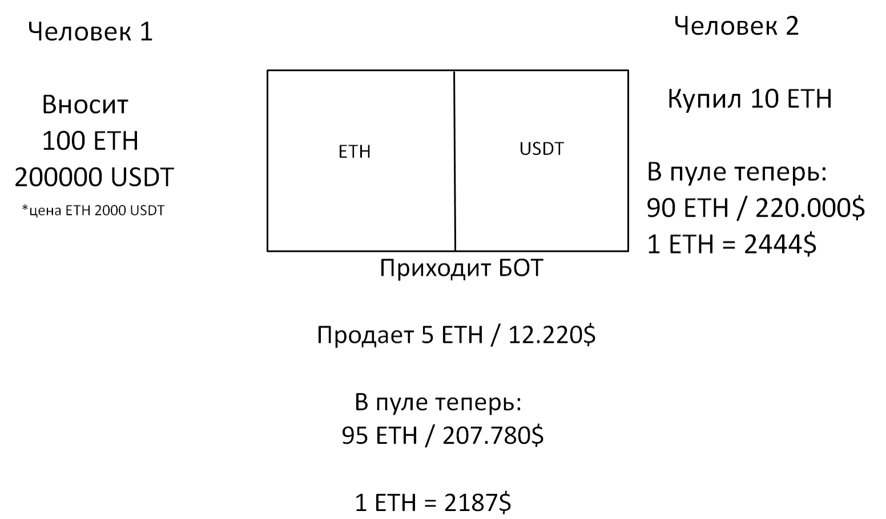
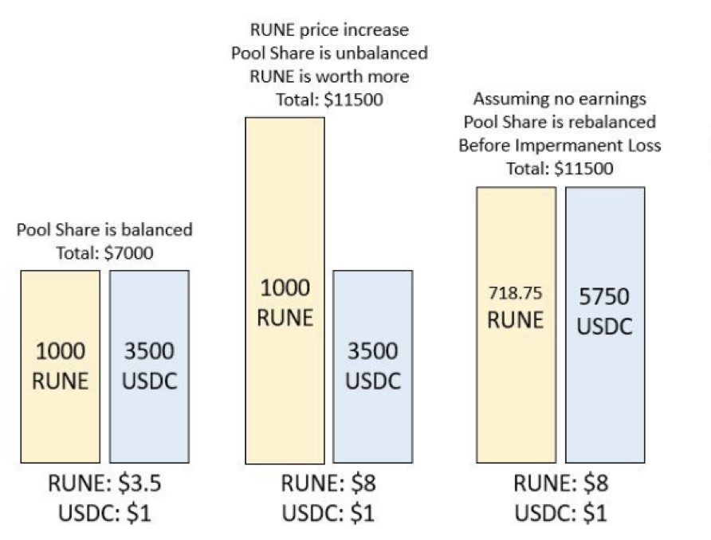

# DEX. Теорія

Что такое фарминг.
------------------

**Фарминг** — cпособ получения прибыли посредством размещения своей криптовалюты в пул ликвидности.

**Что такое пул ликвидности и как он работает?**

Нужно понять, что пулы ликвидности бывают во всех торговых парах, вне завимости от того, CEX это или DEX. Если пара BTC/USDT, то в пуле находятся две монеты — BTC и USDT, если пара — 1inch/ETH, то 1inch и ETH.

Соотношение в пуле ликвидности всегда 50/50, но не в монетах, а в $. Если я хочу предоставить где-то ликвидность, например, на 1000$, то у меня должно быть:

Монета A — 500$;

Монета B — 500$.

Рыночная цена эфира — 2000$, после обмена человека два, цена в конкретном пуле стала 2444$ за эфир (чуть отличается, правда?), конечно, выгодно продать по такой цене эфир и купить его же на другой бирже за 2000$. Для этого нужны арбитражные боты, софт, который никто нигде не афиширует, сфера, в которую попасть практически невозможно, а если вам предлагают на этом заработать — хотят вас заскамить.

Что такое IL (impermanent loss).
--------------------------------

Разберем на примере пула RUNE-USD.

Изначально имеем RUNE и USDC. Весь пул 7000$, значит в пуле RUNE на 3500$ и USDC тоже на 3500$.

Если случается одного из токена, например Rune, то % пула меняется. 1000 RUNE стоит уже 8000$, а USDC (3500$) остается на том же уровне. После того как соотношение меняется, приходят арбитражные боты и уравновешивают соотношения в пуле (в данном случае продают RUNE за USDC).

**В чем потеря?**

А потеря в том, что если вы положили 1000 RUNE и 3500 USDC, то в конце вашего фарма из-за IL вы можете достать в токенах чуть меньше, чем положили, а именно — 718 RUNE и 5750 USDC.

Если бы RUNE рос, вам было бы выгоднее просто холдить, нежели вкладывать пул ликвидности и терять токены на IL.

[https://dailydefi.org/tools/impermanent-loss-calculator/](https://dailydefi.org/tools/impermanent-loss-calculator/) — вот тут можно посчитать вашу потерю с ростом цены.