Знайомство з DeFi
------------
Вот мы и дошли до одной из самых интересных тем во всей сфере крипты. Её название цепляет и пугает одновременно: фарминги, стейкинги, ЛП — все звучит очень сложно, но сейчас мы во всем разберемся.

Вводные данные.
---------------

**DeFi (decentralized finance)** — децентрализованные финансы. Цифровые активы, платформы\\приложения, смартконтракты, которые построены на базе блокчейна. В общем, это фактически банк (он также предоставляет возможность брать активы в залог, отдавать на депозит и прочее), только в крипте и без централизации. Все написано посредством смартконтракта и разработано на БЧ.

**TVL** — уже встречали с вами это слово, но в DeFi оно встречается слишком часто, поэтому напомню, что оно значит. Total Value Locked — общее количество заблокированных средств в протоколе.

Принцип такой: чем больше доверяют протоколу люди, тем больше в протоколе залоченных средств. Но важно понимать, что часто, особенно в самом начале работы какого-то протокола, TVL может быть намного меньше, чем у конкурентов, но из-за этого и доходность в этих пулах будет больше.

Больше TVL — меньше риск — меньше доходность.

Меньше TVL — больше риск — больше доходность.

APY/APR.
--------

**APY — annual percentage yield** (годовая доходность с реинвестирования, % высокий из-за учета сложного процента).

**APR — annual percentage rate** (годовая доходность без реинвестирования).

Есть калькулятор [https://www.aprtoapy.com](https://www.aprtoapy.com), который поможет вам посчитать доходность в различных вариантах.

DeFi сервисы, которые помогут вам в изучении этого направления:
---------------------------------------------------------------

1.  [https://coindix.com](https://coindix.com)
    

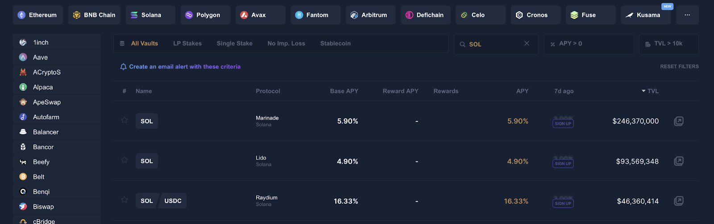

Лучший сервис, который поможет вам «пристроить» вашу крипту. Выбираем нужную валюту и понимаем, что есть вариант застейкать SOL с APY ~6% или закинуть пул с USDC и APY увеличится до ~16%.

1. [https://beefy.finance](https://beefy.finance)

Слоган — Multichain Yield Optimizer. Хороший вариант поиска пулов с % АПИ, есть оценка рисков и прочее. Агрегатор различных сайтов, который предоставляет функционал реинвестирования (делает APR to APY, взимая за это небольшую комиссию).

2. [https://www.coingecko.com](https://www.coingecko.com) / [https://coinmarketcap.com](https://coinmarketcap.com)

Думаю, понятно, зачем эти платформы. Без них никуда, не посмотришь ни адрес смартконтракта, ни объем торгов.

3. [https://www.dextools.io/app/](https://www.dextools.io/app/) / [https://dexscreener.com](https://dexscreener.com) / [https://dex.guru/](https://dex.guru/)

Платформы, на которых можно посмотреть любой график любого щитка, который не торгуется на CEX по смартконтракту. Поддерживают огромное количество сетей. Выбирайте то, что вам удобней и приятней глазу. Лидер для всех разный.

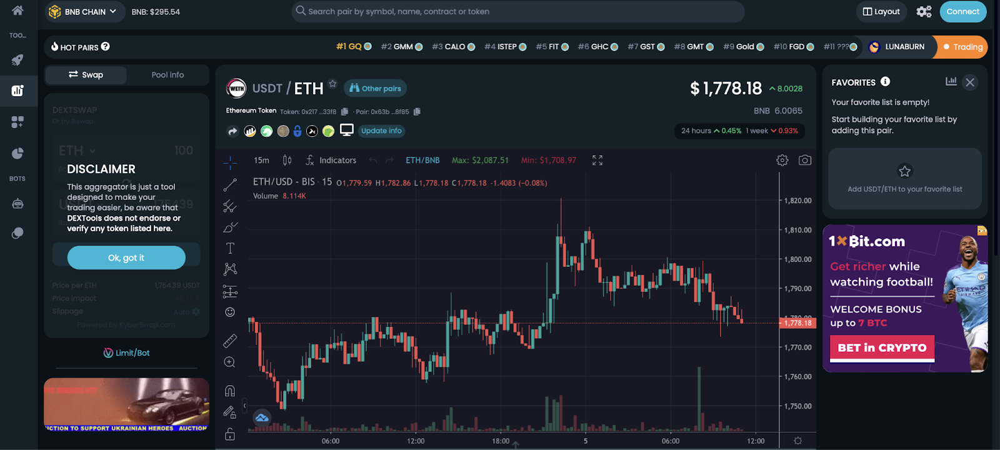

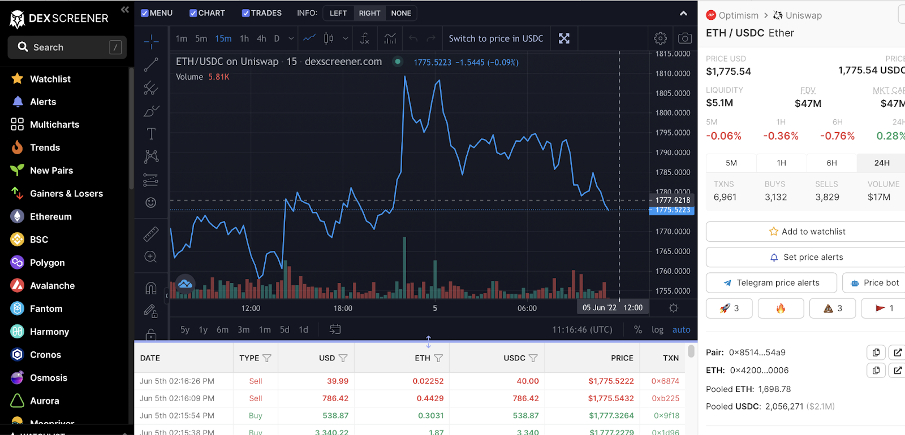

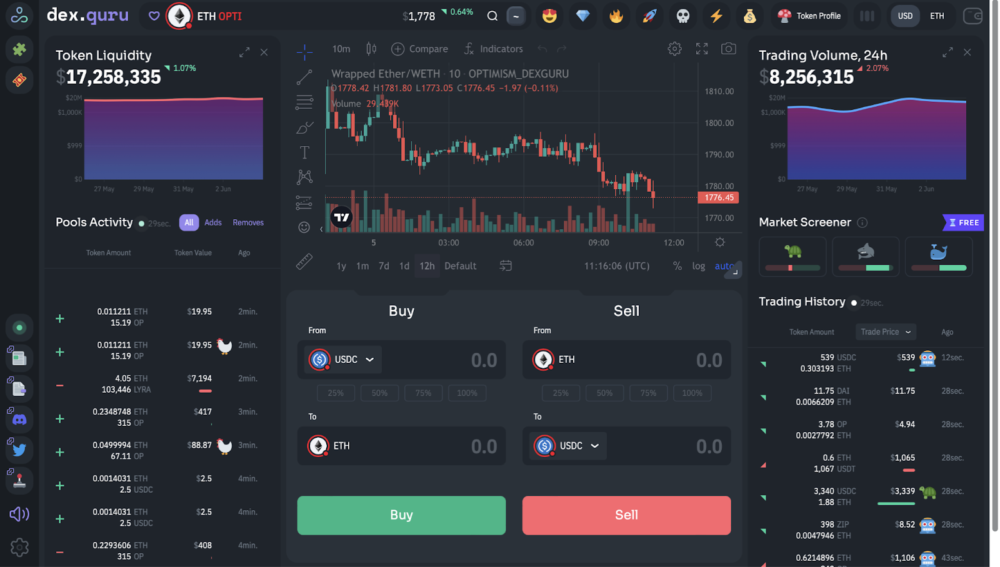

4. [https://coinmarketcal.com/en/](https://coinmarketcal.com/en/)

Трекинг криптоноевентов. Листинги, запуски, АМА и прочее. Обязательный инструмент, если хотите быть в инфополе, ну или просто подпишитесь на Incrypted. :D

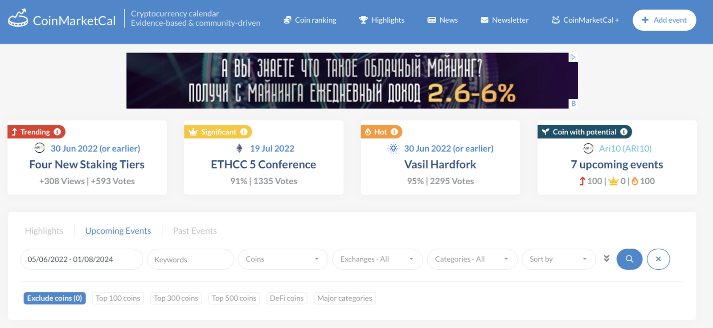

5. [https://debank.com/](https://debank.com/)

Сервис, который позволяет полностью посмотреть балансы кошелька, yan. Можно даже увидеть, где фармятся средства, в каком пуле. Поддерживает только EVM сети.

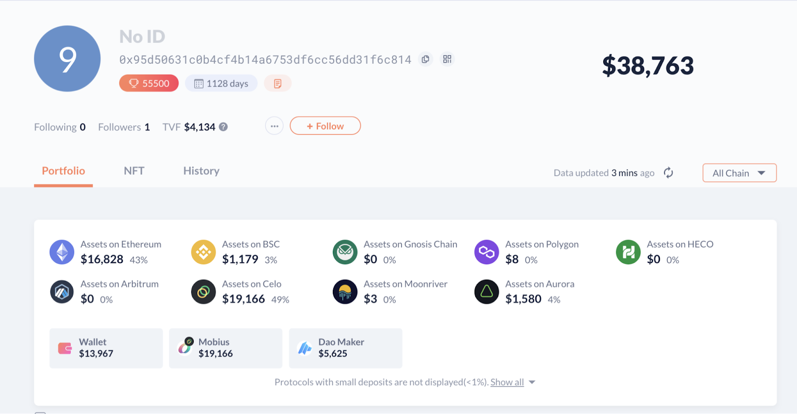

6. [https://zapper.fi](https://zapper.fi)

Сервисы для трекинга вашего портфолио (монет) на кошельке. Но в целом, это может полностью заменить DeBank.

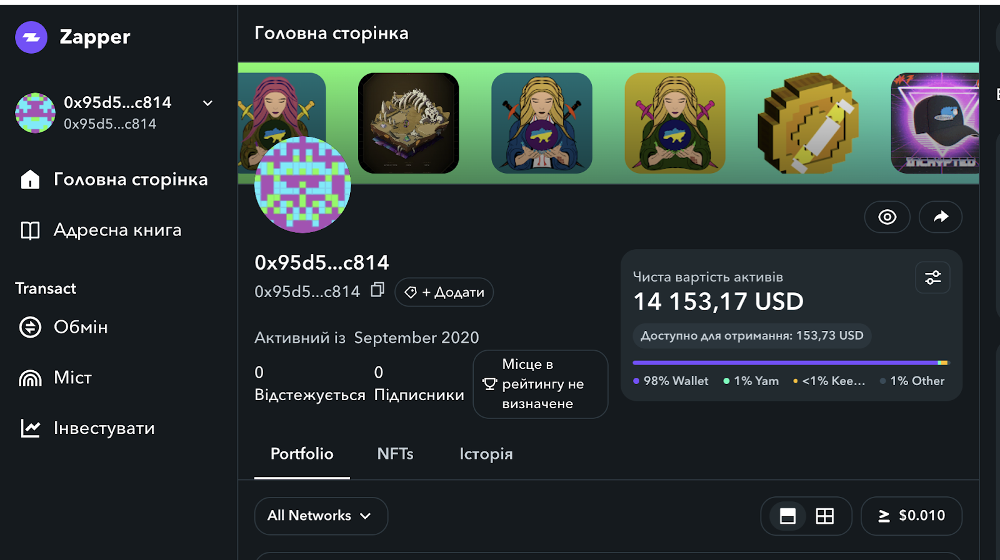

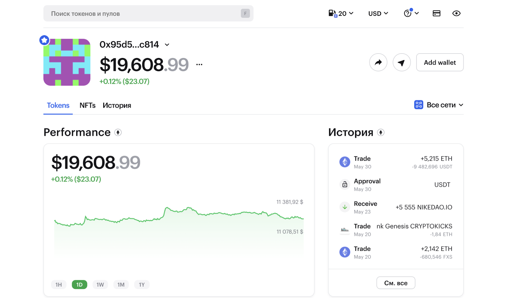

7. [https://dailydefi.org/tools/impermanent-loss-calculator…](https://t.co/m5dL5C3sZf)

Калькулятор IL, топ-инструмент, если фармите в LP токене, а не в сингл ассете.

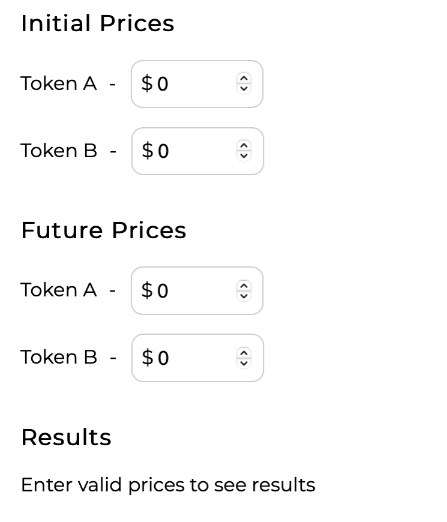

8. [https://defillama.com](https://defillama.com)

Сайт с различными метриками DeFi.

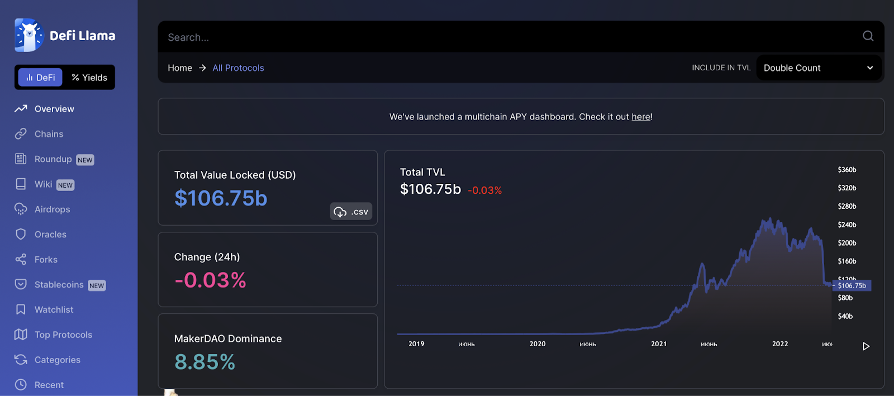

9. [https://glassnode.com/company](https://glassnode.com/company)

Сервис с он-чейн аналитикой. Конкурентов просто нет.

[https://www.youtube.com/c/glassnode](https://www.youtube.com/c/glassnode) - делают еженедельные выпуски с анализом, можно смотреть в свободное время.

10. [https://www.nansen.ai](https://www.nansen.ai)

Уже немного познакомились с этим сайтом на первых стримах. Инструмент, который дает возможность анализировать кошельки, NFT, проекты.

11. [http://Fees.wtf](http://fees.wtf)

Тут можно посмотреть, сколько комиссии вами было сожжено на газ за все время.

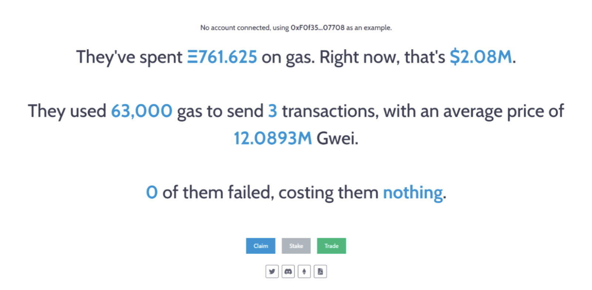