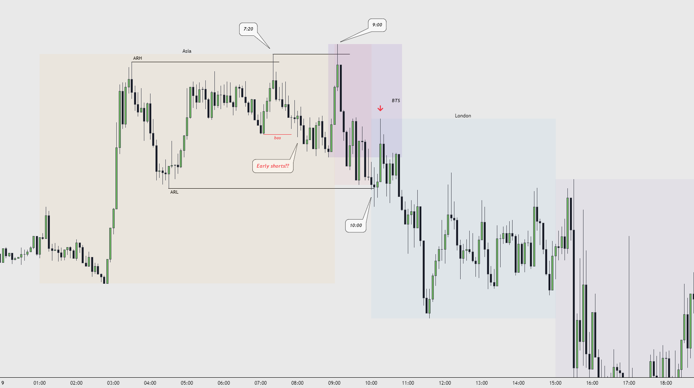

# FX торгівля. Порівняння ринків

**Що таке FX?**
---------------

**FX (Forex)** - міжнародний децентралізований ринок валютних пар.

Торгові пари
------------

На валютному ринку існують такі пари для торгівлі як: **мажорні**, **мінорні** та **екзотичні**.

*   **Мажорні:** EURUSD, GBPUSD, USDJPY, USDCAD, AUDUSD, USDCHF, NZDUSD.
*   **Мінорні:** EURAUD, EURCAD, NZDUSD, AUDCHF, AUDNZD, CADJPY, EURCHF, EURGBP, GBPJPY, NZDJPY, EURJPY, EURNZD, GBPAUD, GBPCHF.
*   **Екзотичні:** EURPLN, USDRUB, USDPLN, EURHKD.

Раджу торгувати мажорні пари, а з часом знайти для себе тільки одну.

2 найкращі пари для торгівлі: **EURUSD / GBPUSD**.

**Брокер**
----------

**Брокер** - це посередник між трейдером і ринком. Він надає доступ до торгівлі валютами, торгових платформ тощо на цьому ринку. Вони заробляють на комісіях за кожну угоду або на спреді (різниці між цінами купівлі та продажу). На ринку криптовалют ці функції виконує біржа.

Торгові термінали
-----------------

**Торговий термінал** - це платформа, на якій трейдер здійснює свою торгівлю.

Існують різні торгові термінали, але ми зупинимося на 2 найбільш використовуваних:

1.  **Meta Trader 4/5 (MT)** - один із найпоширеніших терміналів на ринку. Пропонує простий інтерфейс і різні інструменти для торгівлі.
2.  **cTrader** - також популярний термінал серед трейдерів. Пропонує швидке виконання угод.

На мою думку, найзручніший термінал це **MT5**.

Піпси / тіки
------------

**Піпси (pips)** - це стандартна одиниця для вимірювання того, наскільки змінилася ціна між двома валютами.

Для більшості пар піпс дорівнює **0.0001**. Наприклад, якщо ціна на парі EUR/USD зміниться з 1.09841 до 1.09851, це означає, що ціна піднялася на 1 піпс.

  

**Тіки** - це мінімальна зміна ціни на валютну пару або інший торгований інструмент. Тіки зазвичай вимірюються в пунктах, які є найменшими одиницями зміни ціни. Наприклад, якщо ціна на EUR/USD зміниться з 1.09841 до 1.09842, то це означатиме, що стався один тик. 1 піпс = 10 тиків.

Приклад із TradingView:

На скріншоті ви можете побачити, що Stop Level (Loss) вашої позиції дорівнює 107 тиків, тобто 10,7 піпс.

Як розрахувати розмір позиції
-----------------------------

Розмір позиції вимірюється в лотах, вони бувають: **стандартні** (100 000 одиниць валюти = 1 лот), **міні** (10 000 одиниць валюти = 0.1 лот), **мікро** (1000 одиниць валюти = 0.01 лот).

Для того щоб правильно порахувати розмір позиції використовуємо калькулятор [MyFXBook](https://www.myfxbook.com/forex-calculators/position-size)  або інший альтернативний.

Приклад:

*   **Currency pair**: Вибираєте валютну пару, яку будете торгувати.
*   **Account Currency**: Вибираєте валюту, в якій представлений ваш баланс.
*   **Account Size**: Ваш баланс.
*   **Risk Ratio, %**: Ризик, на який ви хочете увійти в позицію.
*   **Stop Loss, Pips**: Відстань між ціною входу в позицію і рівнем вашого Stop Loss.
*   **Trade Size (Lots)**: Це значення завжди **1**.

Після того як ви правильно вписали значення, натискаєте "calculate" і вам надається лотаж (обсяг) позиції в розділі "sizing". У цьому випадку це **2.08** lots.

Новини та їхній вплив
---------------------

Новини можуть мати значний вплив на ціну. Новини, які пов'язані з макроекономічними показниками, такими як ВВП, інфляція, безробіття тощо, можуть чинити сильний вплив на ринок, тому що вони є сильними факторами, що визначають економічну ситуацію в країні/регіоні.

Торгуючи Форекс, ви повинні стежити за релізами новин та їхнім впливом на ринок. Наприклад, торгуючи парою GBP/USD, ви повинні відстежувати новини щодо GBP і USD. У цьому вам допоможе новинний [календар](https://www.forexfactory.com/calendar).

****

Ми вже писали, що новини бувають різного характеру, вони поділяються на:

*   **Non-Economic**
*   **Low Impact Expected**
*   **Medium Impact Expected**
*   **High Impact Expected**

Ми рекомендуємо не торгувати **medium** і особливо **high impact expected news** під час їхнього релізу, оскільки на графіку може бути "вертоліт". Безліч проп компаній так само забороняють торгувати червоні (high impact) новини. Статистика показує, що найчастіше трейдери втрачають акаунти/депозити саме торгуючи новини.

Графічні приклади:

High Impact News

  

**Торгові сесії. Kill Zones. Їхні особливості.**
------------------------------------------------

Великою перевагою торгівлі на валютному ринку є таймінг у вигляді найбільш волатильних часових рамок. Якщо на крипті ваш сетап може утворитися в будь-який час доби і в будь-який день тижня, то на Форексі є такі часові рамки під назвою **Kill Zones** (далі **KZ**).

Часові діапазони, які нас цікавлять **(GMT +3)**:

Для виділення торгових сесій на графіку можна використовувати індикатори. Дуже зручний індикатор від [BTA](https://ru.tradingview.com/script/tZy3045w-bta-trading-sessions-opens/) :

Приклад на графіку:

Приклад Kill Zones на графіку:

Індикатор [**Kill Zones**](https://www.tradingview.com/script/MSeLR1Nk-ICT-Killzone-Boxes/)

Як можна помітити, ціна найбільш волатильна в часові діапазони **(LOKZ і NYKZ)**. Саме в ці часові рамки рівень концентрації має бути на максимумі.

**Особливості торгових сесій**
------------------------------

Кожна сесія має свої особливості, які варто враховувати під час формування своїх упереджень і пошуку позиції.

### **Asia & Asian Range**

Сесія Азії нас не буде особливо цікавити, оскільки основна ліквідність, яка буде використана під час лондонської КЗ формується в **Asian Range** (далі **AR**). **AR** також може впливати на рух ціни у відкриття Франкфурта.

Приклад №1:

Під час азійської сесії було сформовано ренж, після чого на відкритті Франкфурта була робота з ліквідністю і подальший розворот ціни.

Приклад №2:

На даному прикладі можна чітко побачити роботу з межами азійського ренжа і тільки після цього було сформовано напрямок.

Приклад №3:

У цих прикладах можна побачити волатильну/трендову Азію. У таких випадках часто можна побачити продовження руху за структурою або ж генерування ліквідності для роботи в наступну сесію.

  

### **Frankfurt open / LOKZ / London open time**

Пример №1:

О 3:00 почав формуватися AR. Ще в Пре-Франкфурт ціна зняла ARH, але можна чітко побачити, як о 9:00 була проведена справжня маніпуляція, після якої ми отримали агресивну реакцію і можна було відкрити коротку позицію з таргетом ARL.

Перед відкриттям Лондона можна спостерігати генерування ліквідності та о 10:00 відбулося агресивне знімання ліквідності із захопленням ARL і розворотом ціни.

Цей приклад чудово показує, як наступна сесія працює з ліквідністю попередньої.

Приклад №2:

Цей приклад дуже цікавий на розгляд. На графіку ми можемо побачити, що Азія сформувала ренж. О 7:20 була проведена маніпуляція з ARH і подальше її поглинання із закріпленням у вигляді зламу структури (bos). 99%, що після цієї маніпуляції було відкрито безліч коротких позицій, стоп-лоси яких відмінно виступили додатковою ліквідністю для істинної маніпуляції на відкритті Франкфурта, яка відбулася о 9:00. Після маніпуляції продавці показали силу і намір у ведмежому напрямку.

Лондон відкрився, знявши локально ARL, але це був лише тригер подальшого доставлення ціни для тесту маніпуляції BTS до Франкфурта, підтвердивши цим спадний напрямок.

### **NYKZ / New-York open time**

Менш важливий часовий період, де формується менше сетапів / виходять важливі новини. Протягом цього періоду ціна може працювати з ліквідністю, яка була сформована протягом попередніх сесій або ж може перебувати в діапазоні.

Приклад №1:

У лондонську сесію було сформовано ренж і, як ми вже писали, Нью-Йорк може працювати з ліквідністю, яка була сформована в попередню сесію. У цьому прикладі була робота з High & Low Лондона, після чого висхідний рух.

Приклад №2:

Хороший приклад, коли Нью-Йорк відкривається на продовження заданого напрямку. О 15:25 була робота з внутрішньою ліквідністю у вигляді рейду і оновлення мінімуму з можливістю взяти коротку позицію.

Відмінності між FX і криптою та що вибрати
------------------------------------------

Уважно вивчіть особливості та ризики кожного ринку, щоб вибрати, що підходить саме вам, форекс або крипта. Кожен ринок має свої плюси і мінуси і кожен по-своєму хороший.

Підсумок:
---------

*   Добре, коли Азія формує ренж - високий шанс роботи з ліквідністю ренжа.
*   Трендова Азія - можливість працювати на продовження або очікувати на розворот з подальшим зняттям всієї азійської сесії в наступну торгову сесію. Залежить від контексту більш старшого таймфрейма.
*   Якщо о 3:00 була проведена маніпуляція / заповнення цінового дисбалансу - хороша ймовірність того, що Азія задасть напрямок на LOKZ.
*   Маніпуляції в Пре-Франкфурт можуть бути пасткою для ранніх позицій, навіть якщо вони технічно правильні.
*   Під час торгівлі Франкфуртської сесії краще закривати свою позицію до відкриття Лондонської сесії або ж максимально убезпечити за допомогою парт-тейків (часткових фіксацій) і переведенням стопа в беззбитковість або частковий прибуток.
*   Протягом LOKZ/NYKZ має бути максимальна концентрація.  
    У LOKZ найчастіше відбувається 2 основні маніпуляції (Франкфурт і Лондон).  
    Франкфурт і Лондон можна інтерпретувати як 2 різні сесії.
*   Кожна торгова сесія має свої особливості, які потрібно систематично відстежувати і застосовувати у своїй торговельній стратегії.

**До зустрічі в наступному уроці!**