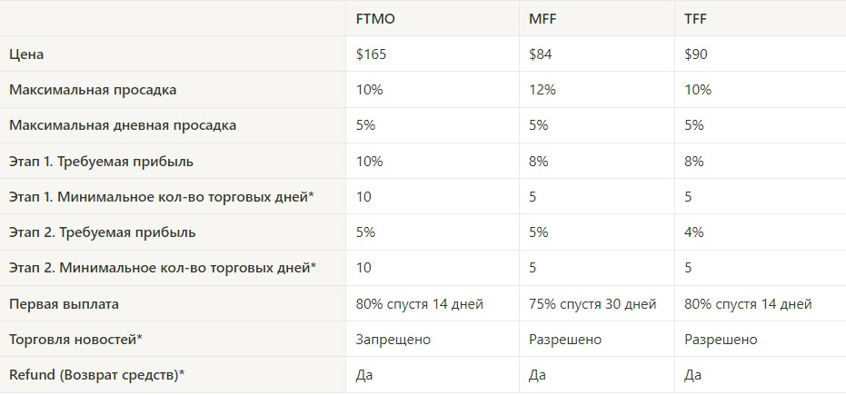

# Знайомство з проп-трейдингом. Вибір проп-фірми

**Проп-трейдинг** - це торгівля на кошти, які компанія виділяє для трейдера. Проп-фірма бере на себе всі ризики, а трейдер натомість повинен підтвердити, що він не є лудоманом і здатний торгувати прибутково.

Підтвердження своїх знань і вмінь торгувати відбувається в три етапи:

1.  **Челендж.**  
    Перший етап перевірки після оплати. Так, за можливість надати проп-фірмі докази, що ви є дисциплінованим трейдером треба платити. Сума залежить від розміру челенджу. Зроблено це з метою не допустити випадковості проходження челенджу непідготовленим трейдером, оскільки компанія ризикує своїми коштами. Умови цього етапу нескладні. Потрібно зробити +10% до стартового депозиту і не допустити при цьому просідання в -10% від стартового депозиту. Ще є денний ліміт на збитки, де за день ви не можете допустити просідання депозиту на -5%. На проходження цього етапу дається 30 днів.
2.  **Верифікація.**  
    Другий і останній етап перед отриманням фінансування. Умови тут значно простіші, ніж у першому етапі. Хоча в більшості випадків саме це і змушує трейдера робити помилки, але зараз не про це. Умови щодо ризиків такі ж як і в першому етапі. Мета - зробити +5% до стартового депозиту. На проходження цього етапу дається 60 днів.
3.  **Отримання коштів в управління.**  
    Після проходження верифікації трейдер отримує фінансування від проп-фірми, де надалі отримує 75-85% від прибутку до свого рахунку. Немає більше умов щодо обмеженого часу або ж певних цілей щодо прибутку, все в руках трейдера. Єдине що, залишаються умови щодо загальних ризиків (-10%) і денного ризику (-5%).

А тепер поговоримо з вами детальніше про проп-фірми
---------------------------------------------------

Наразі є величезна кількість різних проп-фірм, але ми виокремлюємо три основні лідери в цьому напрямі: [FTMO](https://ftmo.com), [MFF(MyForexFunds)](https://myforexfunds.com), [TFF(TrueForexFunds)](https://app.trueforexfunds.com/).

Нижче буде наведено таблицю на прикладі облікового запису на $10k, де ви зможете порівняти їх між собою і вибрати яка більше підходить саме вам:  

**Мінімальна кількість торгових днів** - це кількість днів, в яких повинна бути здійснена хоча б одна угода. Тобто якщо в умовах зазначено мінімальну кількість торгових днів - 5, це означає, що етап буде зараховано тільки тоді, коли у вас буде мінімум 5 днів, в які ви відкривали як мінімум 1 угоду.

**Торгівля новин** - так, але FTMO заборонено торгувати під час "червоних" новин. У разі якщо у вас буде відкрита угода під час цих новин, то це буде вважатися порушенням і ваш челендж або рахунок буде закритий. Новини ви можете дивитися на цьому [сайті](https://www.forexfactory.com/calendar). 

**Повернення коштів** - після проходження двох етапів, трейдер отримує повернення коштів за оплату челенджу щойно дійде до першої виплати.

Вибір не найочевидніший. У кожної компанії є свої плюси порівняно з конкурентами. Якщо ви вже стикалися з проходженням челенджу, маєте тут досвід і хочете взяти в управління від $100k, то тут я б радив вибирати тільки FTMO. Логіка проста, FTMO - перша всесвітньо відома проп-фірма, її можна порівняти з Binance. Якщо Binance скамнеться, то і решта сектору централізованих бірж не витримає, тут така ж логіка. "О! Це не означає, що не варто вибирати MFF або TFF." Навпаки, це дуже гідні компанії і жодних передумов до їхнього скаму немає, тому не варто переживати з цього приводу. Краще остерігайтеся інших, незнайомих для вас проп-фірм.

Якщо ви хочете спробувати і збираєтеся брати свій перший челендж, то можете брати як MFF, так і TFF, для першого досвіду їх буде більш ніж достатньо. Але і тут явним лідером буде TFF і ось чому: найменший необхідний прибуток у кожному з етапів, перша виплата на 2 тижні раніше і на 5% більше, ніж у MFF.

"Це, звісно, добре, але в проп-фірмах здебільшого торгують форекс, індекси, а ми тут усі криптани. Що нам робити?" - і на це питання у нас знайдеться відповідь. Хоч і більшість наших учнів через деякий час починають торгувати форекс через його технічність, але ті, хто люблять торгувати крипту, теж мають можливість торгувати на кошти проп-фірми. І якщо ви збираєтеся торгувати крипту, то я б радив TFF, бо саме у неї найліквідніші крипто пари і найприємніший спред.

Отже, ми з вами вже знаємо що таке проп-фірми і для чого вони потрібні. Здавалося б, іди бери челендж, проходь його і "справа в капелюсі". Але ні, якби було все так просто, то вже кожен другий сидів би вдома і торгував, заробляючи собі цим на життя.

Давайте тоді поговоримо про те, що ж все таки заважає багатьом трейдерам пройти челендж, щоб отримати кошти в управління.

Перше і доволі банальне - це брак знань. Людина, яка слабко знайома з трейдингом - має досить низьку ймовірність на проходження челенджу. Другою проблемою виступає "азартність" людей, які прийшли в цю сферу. Мало хто розуміє, що трейдинг - це далеко не найпростіша робота, хоча це не зупиняє втрачати гроші навіть тих, хто це прекрасно усвідомлює. Чому ж? І ми потихеньку підходимо до третього пункту - психологія та дисципліна. Саме через це більшість втрачають свої кошти і не можуть вийти на стабільний дохід. Знання проблеми - це вже півдороги до її вирішення, тому зараз ви дізнаєтеся основні психологічні складнощі, з якими ви можете зіткнутися під час проходження челенджу.

*   10% на місяць. Цей параметр є хорошим результатом навіть для досвідчених трейдерів. За звичайних умов, коли ви торгуєте на свій власний депозит, мета 10% на місяць є прийнятною, але водночас не створює психологічного тиску, тому що якщо ви зробите умовні 8%, а не 10% - це не вплине ні на що. А при проходженні челенджу - це має негативний вплив на трейдера.   
    **Рішення**: сконцентруйтеся на процесі. Насамперед вам потрібно зберегти депозит, а в разі, якщо ви зробите менше 10%, але водночас не порушите решту правил для проходження - отримаєте новий рахунок.
    

*   Етап 2, "Верифікація". Так, спочатку здається, що після першого етапу - ніяких складнощів на наступному не виникне, адже і днів дається більше, і % до депозиту менше. Але саме це і є пасткою, тому що недосвідчені трейдери, вирішивши, що вони взяли "бика за роги", починають робити банальні помилки, що в підсумку призводить до провалу цього етапу. Хоч сам етап і є простим, багато трейдерів вважають його складнішим.  
    **Рішення**: продовжувати робити те, що ви робили під час проходження першого етапу.

*   Старт із просадки або "lose streak". Найгірше, що може статися під час старту челенджу - це його початок із серії збиткових трейдів. Цей "lose streak" може зловити абсолютно будь-який трейдер, це ніяк не свідчить про його компетентність. Але саме дисципліна під час просідання відрізняє досвідченого трейдера від новачка, тому другі здебільшого намагаються відігратися і забрати у ринку ті кошти, які вони йому віддали, що і призводить до провалу челенджу.  
    **Рішення**: Починайте із заниженого ризику на угоду (0.5%) і торгуйте з цим ризиком доти, доки не наторгуєте собі "подушку безпеки" в +2-3% до депозиту. На жаль, у вирішення цієї проблеми є свої мінуси, а саме час, витрачений на цю саму "подушку", через що ви можете не встигнути досягти необхідних цілей.
    

Тепер, коли ви знаєте основні проблеми, з якими ви можете зіткнутися під час проходження челенджу в проп-фірмі - пройти його вам буде набагато простіше.