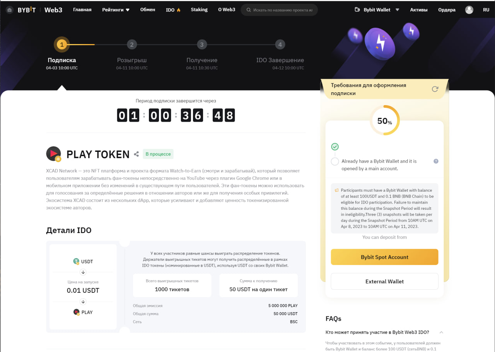

# Беремо участь у сейлі на Bybit

Сейл на ByBit
-------------

Сьогодні ми братимемо участь у сейлі Play на Bybit. Для вас, як криптанів-початківців це чудова можливість зрозуміти механіку сейлів, і, можливо, навіть вдасться заробити за великого везіння. Зараз шанси потрапляння становлять близько 3%, тож не засмучуйтеся, якщо не потрапите, спробувати взяти участь точно варто.

Для участі

*   [Реєструємося](https://www.bybit.com/en-US/depositblastoff/?ref=9949) на ByBit (КУС проходити не обов'язково).
*   Переходимо на [сторінку](https://www.bybit.com/ru-RU/web3/ido/detail?projectCode=30005) IDO і створюємо гаманець (або використовуємо вже створений у разі участі раніше).

*   Вносимо і тримаємо на гаманці щонайменше 100 USDT і 0.1 BNB у мережі BEP-20.
*   Підписуємо участь в IDO і чекаємо результатів.

Всього буде 1000 переможців по 50$ алокації кожен, 0.01$ ціна токена і маємо 100% ТГЕ.

У нас дедлайн 11.04 о 13:00 за Києвом, тож не пропустіть можливість.

Результати лотереї будуть 11.04 о 13:30 за Києвом, а лістинг буде вже 12.04 о 13:00.

**Минулий сейл дав хороші результати переможцям, впевнений що цей теж себе покаже.**