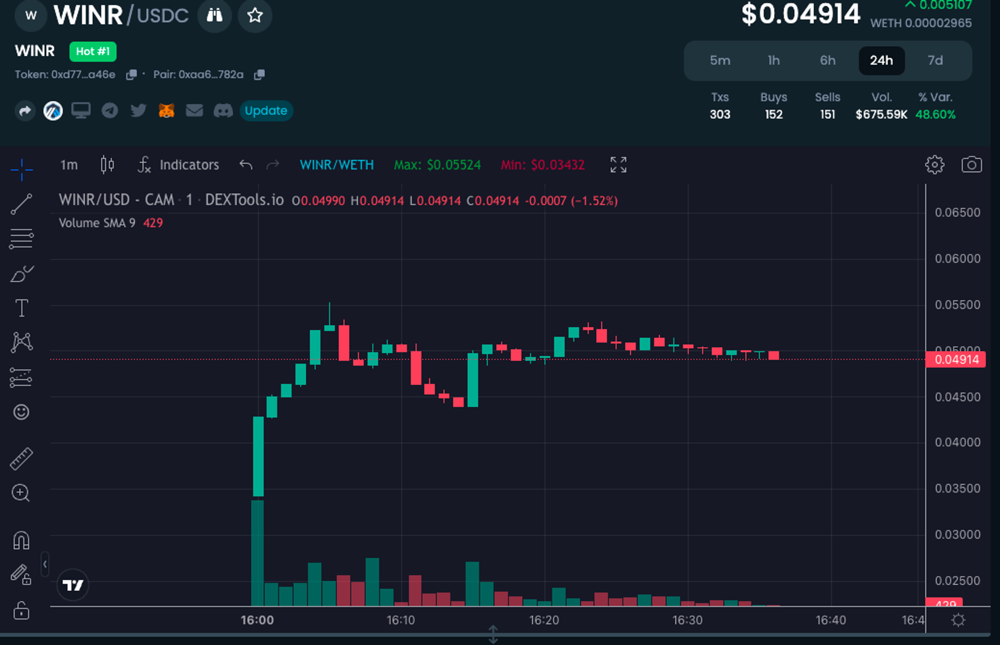

Словник
-------

**Token Release Schedule** - графік розподілу токенів на час життя всього проєкту

**Анлок/розлок** - розблокування токенів.

Як аналізувати?
---------------

Завжди потрібно дивитися все в комплексі і всі аспекти важливі. Для вас ніколи не буде ідеального проєкту, в якому все буде ідеально, тож потрібно підходити до проєкту комплексно. Зрозуміло, що є якісь пункти, які критичні можуть бути, а на якісь частково можна і закрити очі. Нумо розбиратися послідовно.

Команда
-------

Якщо команда вже з якимись крутими чуваками, які запускали успішні проєкти, тоді шанс, що вони накосячать, - набагато менший, і у людей відповідно більше довіри до цього проєкту. Подивитися їхнє минуле можна через LinkedIn. До того ж варто розуміти, що досвідчені люди зможуть вийти з кризової ситуації набагато краще для нас, ніж ті, у кого цього досвіду немає.

Наведу приклад хорошої команди. Був один проєкт, який хотів запускатися в мережі солани, але через нещодавні події команда вирішила закрити проєкт і повернути гроші, що залишилися, інвесторам, замість того, щоб годувати їх сніданками і надалі не реалізувати проєкт.

Потреба в токені
----------------

Завжди потрібно звертати увагу навіщо проєкту потрібен токен. Часто буває таке, що токен проєкту взагалі не потрібен, і вони його роблять, щоб зібрати грошей з інвесторів, і таке нам взагалі не цікаве, оскільки він може і вийде в плюс, але нікому цей токен не потрібен буде, і він одразу вкатається в 0.

Юзабіліті токена завжди треба шукати в документації проєкту і дивитися за що він відповідає. Зазвичай чим більше всяких прикольних фіч - тим краще. Ще я б завжди дивився на можливість його спалювання і подібних механізмів зменшення кількості токенів в обороті.

Фонди
-----

Багато хто шукає проєкти, в яких виключно топові фонди, але зараз це не панацея. Зараз у фондів настільки багато грошей, що вони іноді кидають у все підряд аби гроші працювали.

Для них закрити раунд у кілька десятків мільйонів може бути взагалі не проблема, оскільки для них це кілька відсотків їхнього депозиту. Щоб відрізнити якість фондів, раджу заходити на їхні сайти і дивитися їхні портфоліо. Що більший відсоток проєктів, які ви знаєте, і що вони торгуються на топових біржах - то кращий фонд. Ця "база даних" буде накопичуватися у вас у голові з часом, тож спочатку може бути трохи важкувато.

Якщо портфоліо немає або ви забули інформацію про фонди, то заходимо на [CryptoRank](https://cryptorank.io/funds) і дивимося куди заносив цей фонд.

Зараз досить важко сказати за ким варто стежити, тому що з огляду на останні події на ринку багато фондів можуть виявитися банкрутами і переробляти свою структуру управління/роботи, а не повністю бути залученими в інвестування.

Токенометрика
-------------

Це моя найулюбленіша категорія, тому що найчастіше за нею можна навіть зрозуміти скільки теоретично іксів можна винести з проєкту Метрики це чиста математика. Тут головне це вміти додавати, віднімати, множити і ділити числа, тож нічого складного немає.

Потрібно аналізувати дистрибуцію токенів, скільки % токенів у команди/сіда/привату/партнерів, який у них вестінг-період, який % токенів виділено на маркетинг/еірдропи та іншу ком'юніті-двіжуху, а також який % токенів виділено на сам паблік цей, і найважливіше - які в них ціни, адже погодьтеся, якщо ви бачите, що проєкт дуже класний, але токени продають дуже дорого, або ви в них будете довго сидіти через величезні вестинги, то який нам сенс брати участь у сейлі, якщо потім у теорії можна буде купити токени дешевше.

Раунди
------

Розбираємо на прикладі токена [Moonbeam.](https://moonbeam.foundation)

Майже кожен проєкт перед тим як залиститися на біржу збирає гроші на свій розвиток, розповім стандартну схему, але зараз є купа варіацій. Найчастіше ці параметри можуть відрізнятися залежно від типу проєкту. Погодьтеся, весь умовний лендінг протокол не потребує токенів для розвитку екосистеми або стимуляції дэвов (адже там це просто не потрібно).

1.  **Pre-seed/Seed sale** - найбільш ранній раунд (ну і найменша ціна, звісно ж) - вигаданий він для головних партнерів, ангел-інвесторів і подібних особистостей. На ньому найнижча ціна, але й найдовший анлок. Зазвичай туди потрапляють ті, хто може принести найбільше користі проєкту в довгостроковій перспективі.
2.  **Private sale** \- дорожчий за seed'а і більша кількість людей, але потрапити туди теж неймовірно складно як для людини "з вулиці". Зазвичай цей раунд для "великих дядьків" з великими грошима. Туди потрапляють фонди та інфлюенсери, ті, хто можуть допомогти не тільки $, а й маркетингом. Анлоки теж мають бути не швидкими, але менше ніж в seed. Ціна також має бути вищою за попередній раунд.
3.  **Public sale** - продаж токенів усім охочим за найбільш "невигідною" ціною, за те без вестінгів (або з найшвидшими на тлі привату/сиду), купив - почекав лістингу - продав - забрав ікси. Ось саме в Public Sale таким простим роботягам як ми і залишається брати участь, тому говорити будемо про нього. Потрібно розуміти, що в пабліку в 90% сидять фліпери. Купити - продати, ніякої віри в проєкт і ходл.
4.  **Team & Advisors** - команда й адвайзери. Ті люди, які не платять нічого за токени. Команди виділяє собі токени як людям, які розвивають проєкт, а адвайзери отримують токени за свою допомогу в запуску/виходів на біржі та інше. Якщо у проєкту дуже швидкий розлок токенів команди і адвайзерів, то це дуже-дуже погано. Адже зібралася команда фліперів і вони просто хочуть налутати $ якомога швидше. Анлоки бажано, щоб починалися після закінчення анлоків у seed, private і public раундів.
5.  **Liquidity** - те, скільки % команда виділяє на ліквідність DEX/CEX.
6.  **Marketing & Treasury** - фрішні токени проєкту, якими можуть платити інфлам за маркетинг, роздати аірдроп користувачам. Ці токени не йдуть у стакан, вони призначені для різних витрат, які прорахувати на стадії запуску проєкту практично не можна.

Найчастіше проєкти показують ці раунди в подібних діаграмах, щоб було легше зрозуміти, що куди йде:

Також дуже корисна і важлива штука це графік розлоків або Token Release Schedule. Нам це теж важливо знати, тому що потрібно розуміти, з якими раундами у нас будуть анлоки і хто в теорії може дампити ціну замість нас:

Найчастіше такі документи виглядають приблизно ось так. Цей папірець нам потрібен для того, щоб зрозуміти в який момент часу скільки монет буде на ринку. Для фліпа дивимося на ліву частину графіка, а для холда на іншу частину, але це зовсім інша історія.

Як порахувати ікси?
-------------------

У проєкту завжди є **Initial Market Cap** і насамперед вона нам потрібна. Якщо простими словами, то це скільки проєкт коштуватиме на самому старті.

Якщо у проєкту початкова капіталізація вища від усього сегмента, то іксів там багато бути не може.

Найчастіше метрики можна знайти на сайті проєкту і їх завжди потрібно порівнювати з конкурентами по сектору. Для порівняння найкраще використовувати [Coingecko](https://www.coingecko.com), [CoinMarketCap](https://coinmarketcap.com), [DropsTab](https://dropstab.com).

Розглянемо на прикладі недавнього сейлу **JustBet**.

JustBet - децентралізоване казино на Arbitrum. IMC - 2.25M$, price 0.029$ 50% токенів отримуємо одразу на ТГЕ, а половину за 15 днів після запуску проєкту. Сам проєкт середнього рівня, нічого особливо видатного. Заходимо на Dropstab і шукаємо категорію [Gambling](https://dropstab.com/categories/gambling), на якій ми можемо бачити таку картину:

Оскільки проєкт у нас не найвищого рівня, то я б порівнював із проєктами, які коштують у районі 3-4М, оскільки нижче просто проєкти з сайтами, які відносно не працюють. Оскільки ми отримуємо 50% на ТГЕ, то нам треба отримати х2 на старті, щоб винести тіло інвестицій. Виходить таке рівняння IMC * потрібна кількість іксів ⇒ MC конкурентів.

На нашому прикладі виходить 2.25М*2 = 4.5M капіталізації на старті, щоб винести тіло. Як ми бачимо, що це досить близькі показники і особливо немає "запасу" до конкурентів, у разі якщо ми виявимося не правими.

За підсумком ми отримали 1.8-1.9 (приблизно, як і стоять конкуренти) і відповідно не винесли тіло на першому анлоці. Так, ви скажете, що можна ще заробити на залишку токенів, проте часто таке трапляється, що токен сильно укочується і до пуття нічого не виходить заробити, тож намагаємося щонайменше винести тіло на першому анлоці, а щонайбільше заробити.

До зустрічі в наступному уроці!