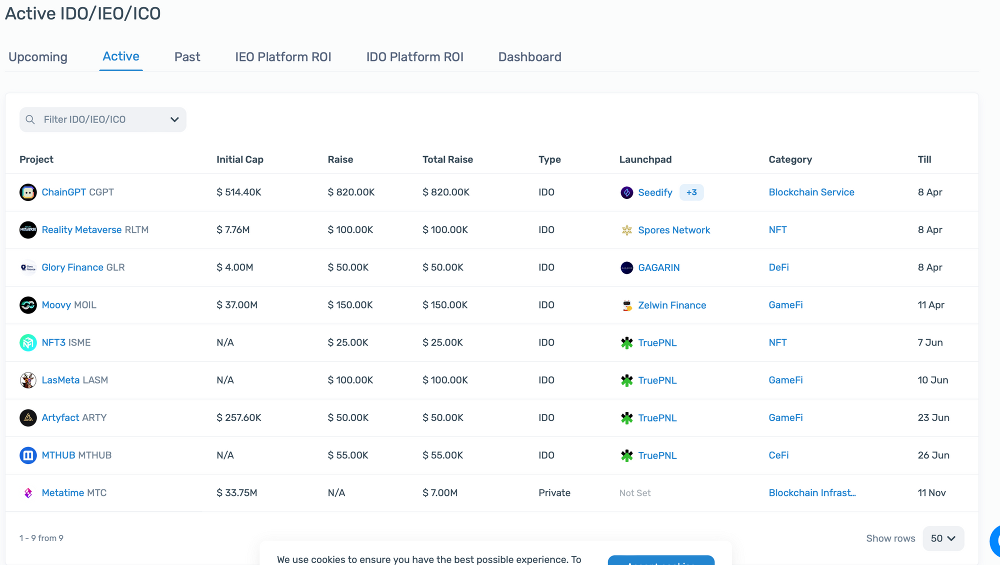
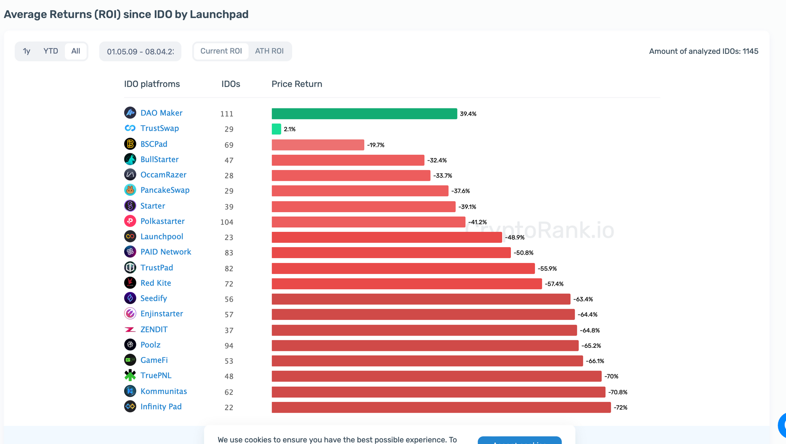

# Пошук проєктів

Підписки
--------

Без цього пункту абсолютно всі подальші дії будуть марними, тому що ви не знатимете, де банально шукати проєкти, в яких ви братимете участь.

Для пошуку є величезна кількість ресурсів, починаючи від банального запиту в Twitter і пошуку за підписками різних інфлюенсерів, публічних осіб, власників криптофондів тощо.

Звісно, всі такі хлопці будуть шилити свої інтереси або сумки, тож варто уважно аналізувати проєкти, а як це робити розповім трохи пізніше. Дивіться на тих, кому важливе своє ім'я і репутація. Не бійтеся заглиблюватися в нетрі і залазити в ті кути, в які ніхто навіть не дивиться.

Також є багато різноманітних твіттерів, на які варто підписатися, проте варто слідкувати не за їхніми твітами, а за тим, на кого вони підписані, бо багато хто з них має свої інтереси (алокаціі чи $) і ви можете в найкращому варіанті втратити свій час чи гроші.

З чого почати?
--------------

Для початку я б створив окремий твіттер (щоб не сильно засмічувати свій основний) і підписався на акаунти топових майданчиків, де виходять сейли в першу чергу:

[https://twitter.com/CoinList](https://twitter.com/CoinList)

[https://twitter.com/TheDaoMaker](https://twitter.com/TheDaoMaker)

[https://twitter.com/TokensoftInc](https://twitter.com/TokensoftInc)

[https://twitter.com/binance](https://twitter.com/binance)

[https://twitter.com/Bybit_Official](https://twitter.com/Bybit_Official)

Агрегатори
----------

Далі переходимо до агрегаторів, на яких ми зможемо знайти щось менш якісне за рівнем сейлів, але таких сейлів буде більше. З таких сайтів агрегаторів я б вибрав [Cryptorank](https://cryptorank.io/active-ico)

Тут можна побачити як і активні сейли, так і майбутні, які можна з легкістю проаналізувати. Також можна подивитися на яких платформах як виходять проєкти і подивитися будь-які інші метрики:

Також я б подивився в бік сайту Crypto Fundraising. Тут з'являється інформація про проєкти, які зовсім недавно закрили якийсь із приватних раундів або просто раундів фінансування. **Тут є 2 варіанти використовувати цей сайт:**

1.  Шукати проєкти, в яких за активності ви можете отримати $, НФТ або алокацію в паблік раунд за активності.
2.  Якщо ви щось можете запропонувати проєкту, то в теорії зможете самі потрапити в приватний раунд.

З тих фондів за ким можна дивитися це A16Z, Sequoia Capital, Polychain, Parafi, Paradigm, DradonFly, Framework, Multicoin і багато інших.

Інфлюенсери
-----------

Знову ж таки повертаючись до початку методички хочу сказати, що ці твіттери ми використовуємо лише для пошуку проєктів. Я б не радив без власного аналізу залітати в усі проєкти, які шилять різні інфлюенсери. Замість цього я вважаю за краще лазити за їхніми підписками у твіттері або шукати ресерчерів-аналітиків різних венчурних фондів. Найчастіше у таких хлопців проєкти перебувають на дуже ранньому етапі, тож якщо ви щось можете запропонувати проєкту, то в теорії можете спробувати потрапити в приватний раунд.

Я вам нижче накидаю список цікавих акаунтів, але ви зможете знайти більше в моїх [підписках](https://twitter.com/oleg_smg/following).

І так, якщо ми говоримо про вартісні акаунти, то я б передусім підписався б на таких:

[https://twitter.com/PeteCryptoVC](https://twitter.com/PeteCryptoVC)

[https://twitter.com/eddylazzarin](https://twitter.com/eddylazzarin)

[https://twitter.com/zmanian](https://twitter.com/zmanian)

[https://twitter.com/CoffeeTimesTW](https://twitter.com/CoffeeTimesTW)

[https://twitter.com/FrankieIsLost](https://twitter.com/FrankieIsLost)

[https://twitter.com/AvaxGems](https://twitter.com/AvaxGems)

Згодом як ви будете занурюватися в цей сегмент, тим більше цікавих акаунтів ви зможете знайти.

**До зустрічі в наступному уроці!**