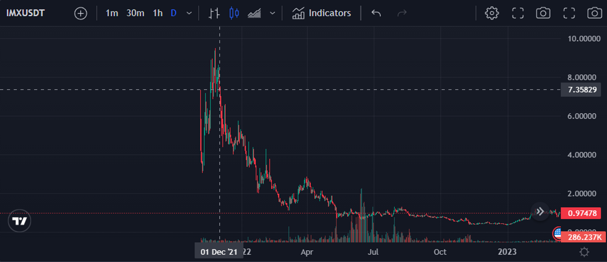
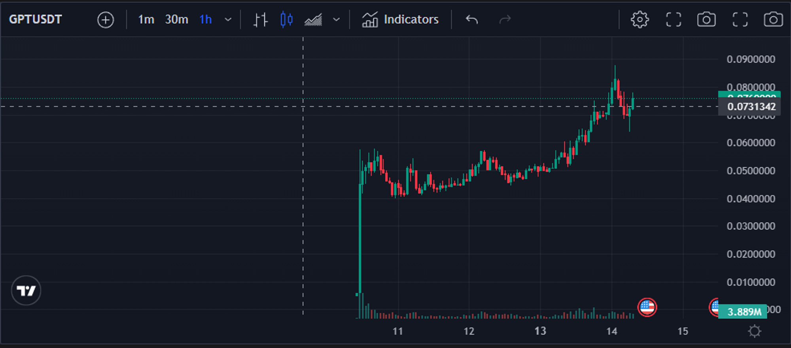
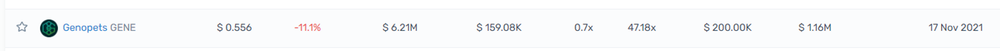
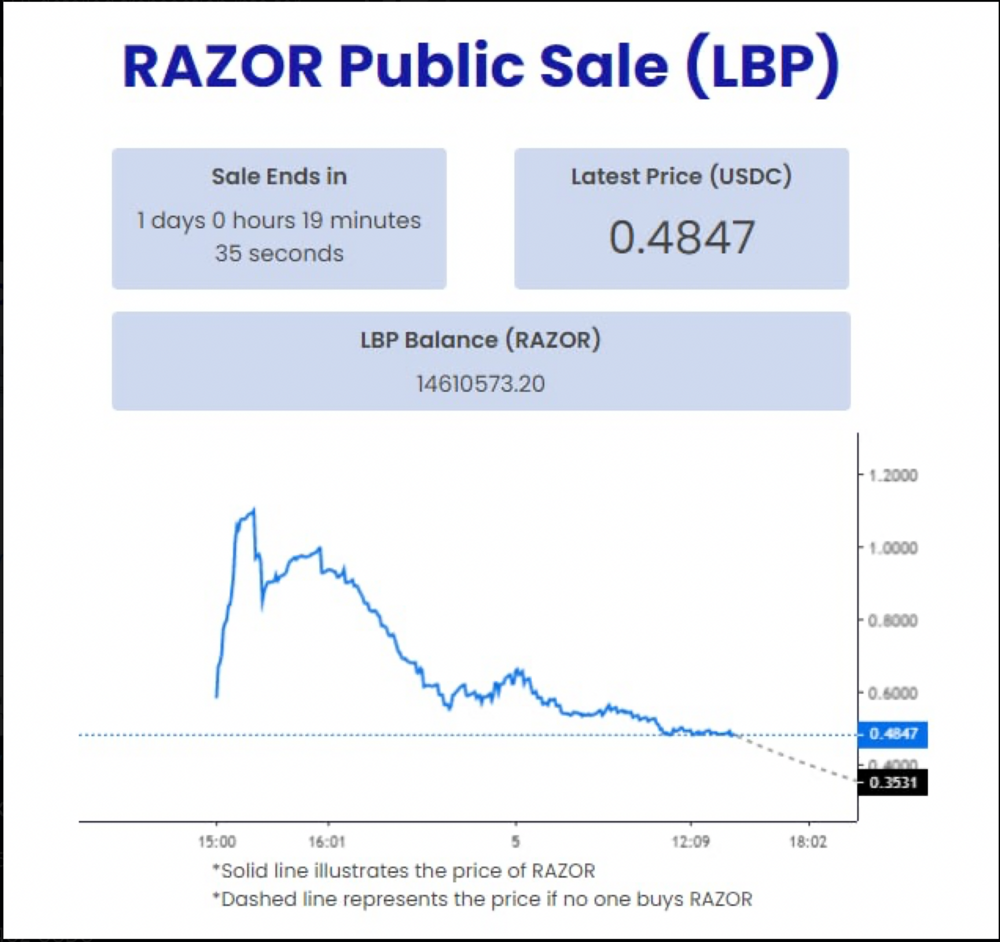
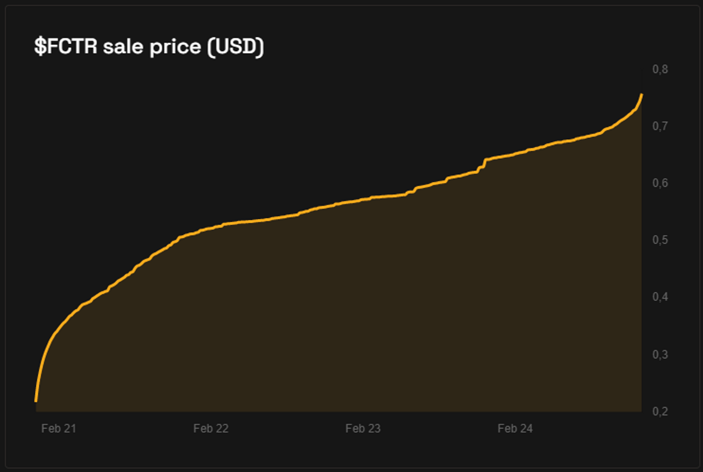

# Знайомство з ICO

Словник
-------

**TGE (Token Generating Event)** \- Найчастіше так називають перший лістинг, під який відбувається випуск і розподіл токенів на гаманці/акаунти користувачів, які брали участь у сейлі.

**Алокація** \- сума грошей, яку ви маєте право інвестувати в проєкт.

**Вайтлист** \- список гаманців, яким дозволено отримати алокацію.

Снепшот - знімок/запис вашого балансу/дій на акаунті, на якийсь момент часу.

**Вестинг** \- блокування і метод розподілу токенів. Наприклад, проєкт каже, що вестінгу не буде, тоді на ТГЕ ви отримуєте всі 100% токенів, у разі якщо проєкт говорить про 12-місячний вестінг, ми маємо 100% поділити на 12 міс і отримати 8.3%. У такому разі, нам щомісячний розлок дорівнюватиме 8.3% щомісяця.

**Кліф (також лок)** - блокування токенів.

**Лістинг** \- поява токена на біржі.

**Лаунчпад** \- майданчик для зборів грошей для проєкту. Здебільшого саме тут користувачі вперше зустрічаються з проєктом.

Що таке ICO і як на ньому заробити?
-----------------------------------

**ICO (Initial Coin Offering)** - вид залучення інвестицій у вигляді продажу токенів для невеликого кола осіб за цінами, які часто нижчі, ніж після лістингу на біржі.

Основна різниця зі звичайною торгівлею полягає в тому, що ви, зайшовши на умовний Binance, можете купити будь-яку монету в будь-якому обсязі, а тут такого не відбувається, тому що на пре-сейлах є "закрите" коло людей, яке має можливість купити токени за запропонованою ціною. По суті робиться штучний дефіцит. Найкращим прикладом буде аналог з випуском нових лімітованих кросівок, які хочуть абсолютно всі, але тираж всього 1000 пар.

Хочу навести приклад на лаунчпаді Coinlist.

1.  Створюємо акаунт на платформі.
2.  Стаємо в чергу в момент сейлу.
3.  У разі потрапляння в прохідний пул людей ви можете заповнити свою алокацію в розмірі 100-500$.

Якщо дивитися на живому прикладі, то подивимося на прикладі IMX. У нас була алокація в 500$ за ціною 0.1$ і вестинг протягом 6 місяців, тобто ми отримуємо 16.6% токенів на старті.

Якщо ми подивимося на графік, то ми можемо бачити, що токен почав торгуватися по 7$ від самого початку, але реально було злити десь по 5.5$.

Що у нас виходить? - Наші 16% від 500$ можна було продати на 55х, а в доларах це 500550.16 = 4400$ ми отримуємо відразу, а решту токенів у вигляді "зарплати" протягом ще 5 місяців.

Як на ньому заробити?
---------------------

Здебільшого, наше завдання полягає в тому, щоб купити токен на сейлі і продати його на TGE.

Чому так? - Причина в тому, що дуже часто у нових проєктів пік ціни припадає якраз на TGE. Ми не можемо зрозуміти напрямок руху ціни, тому що ще немає історії торгів, фундаметнальних новин, а також на ринок будуть приходити токени з вестингу різних раундів.

У чому різниця між видами сейлів?
---------------------------------

Якщо ми почали розбиратися в сейлах, то давайте дізнаємося які найпоширеніші види бувають. Якщо трохи забігти наперед, то можна сказати, що поняття ICO/IEO і IDO дуже схожі, так, є невеликі відмінності, але основний принцип обмеженої пропозиції залишається незмінним.

IDO
---

**IDO (Initial Dex Offering)** \- різновид продажів токенів, який часто зустрічається на різних децентралізованих (і не дуже) криптопрощадках. Відмінність полягає в тому, що на цих майданчиках найчастіше проєкти далеко не найвищого рівня, а за наявності хорошого проєкту, то туди досить важко потрапити.

Давайте розберемо на прикладі лаунчпада від DAO Maker:

1.  Dao Maker оголошує IDO проєкту.
2.  В умовах написано, що потрібно тримати 500$ у будь-якій монеті на своєму гаманці.
3.  Підписуємося на соціальні мережі проєкту.
4.  Отримуємо якусь кількість квитків по 50-100$ алокації.

Хороший приклад з CryptoGPT. Умови - Ціна 0.005$. 10% TGE, потім 90 днів кліффа і по 4.5% на місяць надалі.

Токен залистився трохи більше 10х, що ми змогли забрати тіло інвестицій, а залишок через 3 місяці почне приходити як зарплата.

IEO
---

**IEO (Initial Exchange Offering)** \- те ж саме що й IDO, але проводять його на CEX біржах. У більшості випадків на хороших біржах ікси будуть завжди, але алокації зовсім маленькі або маленька ймовірність потрапити. Також існує варіант потрапляння через перепідписку для власників токена біржі, на якій і відбувається запуск.

Тут не потрібна реєстрація нових акаунтів, важких взаємодій з гаманцем тощо. **Наведу приклад на кейсі Binance:**

1.  Бінанс оголошує IEO якогось проєкту.
2.  Публікує посилання, де потрібно зареєструвати свій акаунт у сейл.
3.  Далі відбувається снепшот вашого балансу.
4.  Далі пул нагород ділитися серед усіх учасників, у % співвідношенні з його внеском BNB/BUSD.

Алокації в подібних сейлах мізерно маленькі, бо реальних холдерів BNB дуже багато, і там величезні сумки, які були набрані по 1-3-10$ за BNB, ну а пул нагород один для всіх. І якщо розділити нагороди на всіх виходить дуже-дуже мало, але ікси точно будуть. Маленький ризик - маленькі нагороди.

**Інший приклад можу навести на біржі ByBit, в якому використовується система квитків:**

1.  Байбіт анонсує новий сейл.
2.  Потрібно тримати 300$ на акаунті протягом сейлу.
3.  У визначений час ви отримуєте лотерейний білет із порядковим номером.
4.  Якщо ваш квиток виграв, то ви можете заповнити вашу алокацію в розмірі 300$.

Тут потрібне везіння або велика кількість акаунтів, але з іншого боку, ікси гарантовані, тому що біржа сама зацікавлена в успішному запуску токена.

Одним з останніх за такою моделлю запускався проєкт Genopets і в піку було 47х. Так, на хаї продати анріал, але навіть якщо продавати на 10-15х, то чистими можна витягнути 2700-4200$ з акаунта.

LBP і Fair Launch
-----------------

Однак, водночас існує трошки інший формат сейлів під назвою **LBP і Fair Launch.**

**LBP (Liquidity Bootstrapping Pool)** \- за фактом, система-розподільник, яка малює ціну, виходячи з попиту. Є мінімальна ціна, є гранична ціна, решту вирішує попит. Зазвичай на таких аукціонах ціна від початкової йде вниз через постійне додавання в нього токенів.

Регулювання ціни залежить від кількості ліквідності в пулі та графіка додавання токенів у нього з боку команди, а також від інтересу людей купувати за певною ціною. Про пули ліквідності і як вони працюють ви дізнаєтеся на уроці про DeFi.

Як приклад ви можете побачити сейл токена Razor, який відбувався за цією системою.

У перші хвилини сейлу натовп побіг купувати токен, не особливо розуміючи, як працює дана система, через що і стався памп токена, після чого команда за заздалегідь прописаною стратегією почала систематично додавати токени на ринок, унаслідок чого ціна почала йти вниз.

Як правильно брати участь у LBP?
--------------------------------

Коли цей вид сейлів був популярний, то ми використовували мікс із кількох пунктів:

1.  Заздалегідь прописати ціни, за якими були б цікаві покупки. Потрібно залишити запас для іксів або купувати за відверто дешевими цінами.
2.  Потрібно стежити за великими гаманцями, які беруть участь у цьому сейлі. Припустимо, ви бачите, що якийсь кіт купує на кілька сотень тисяч доларів цей токен. Ви стежите за його діями через блокчейн провайдер і можете спробувати повторювати його дії.
3.  Купувати в накопиченні. У якийсь момент сейлу ми можемо спостерігати боковик, а отже, що за даною ціною є повішений інтерес до купівлі токена у людей за цією ціною. 

Fair Launch
-----------

**Fair Launch (чесний запуск)** - нова модель запуску токена. Основна відмінність полягає в тому, що після стартової ціни через попит токен починає зростати після кожної покупки юзера. Наприкінці аукціону всі отримують токени за однаковою ціною, за якою і закрився сейл.

Давайте подивимося на сейл токена **FCTR**. З самого початку у нас була ціна в 0.2$, після чого через попит від людей ціна почала неухильно зростати до 0.75$.

Проблематика сейлів
-------------------

Основна проблема LBP і Fair Launch полягає в тому, що в ці сейли потрапити може кожен або майже кожен. Через це і зникає ця найобмеженіша пропозиція, і нам немає кому продавати свої монети, оскільки багато хто купив разом з нами. 

**До зустрічі в наступному уроці!**