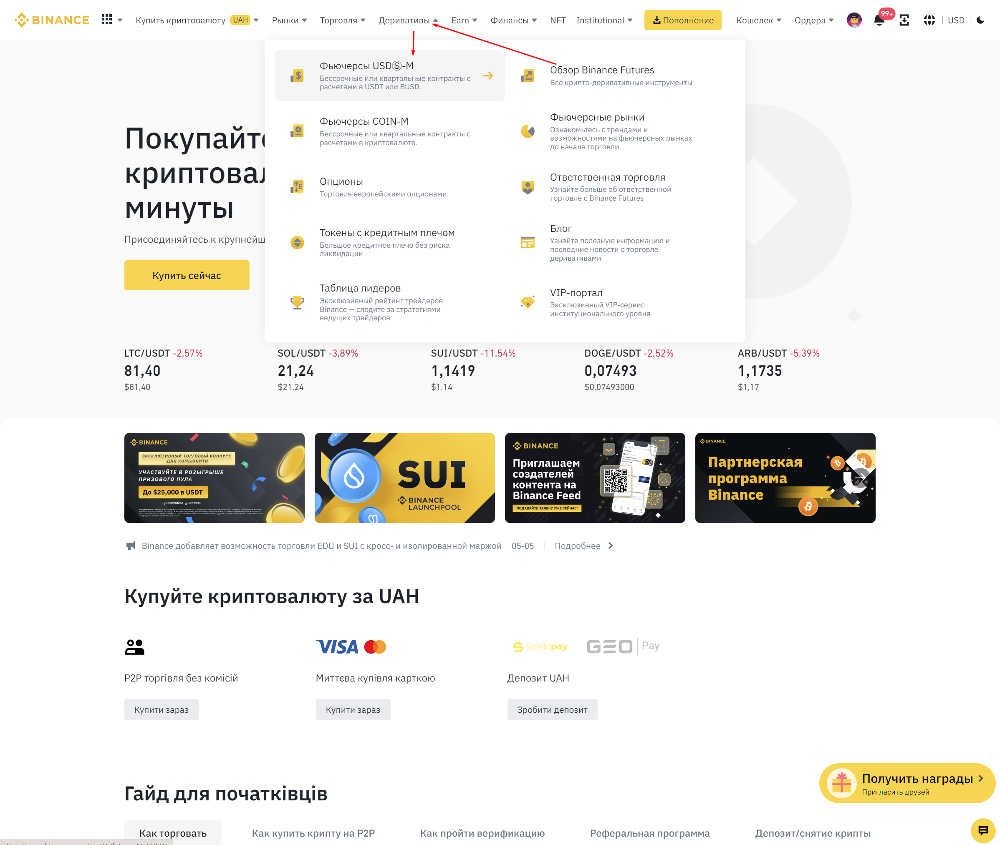
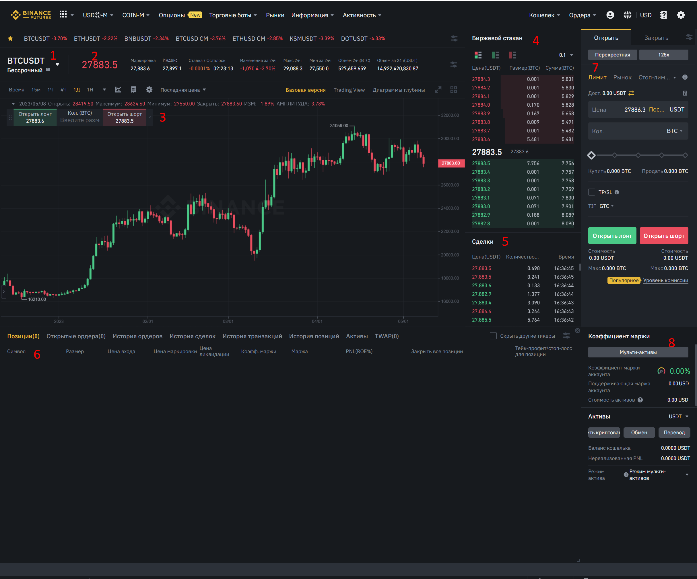
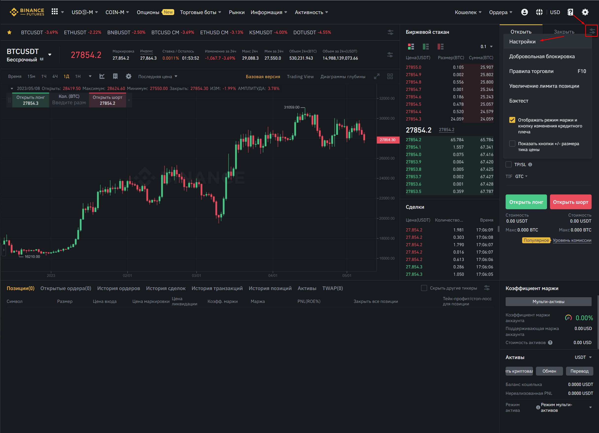
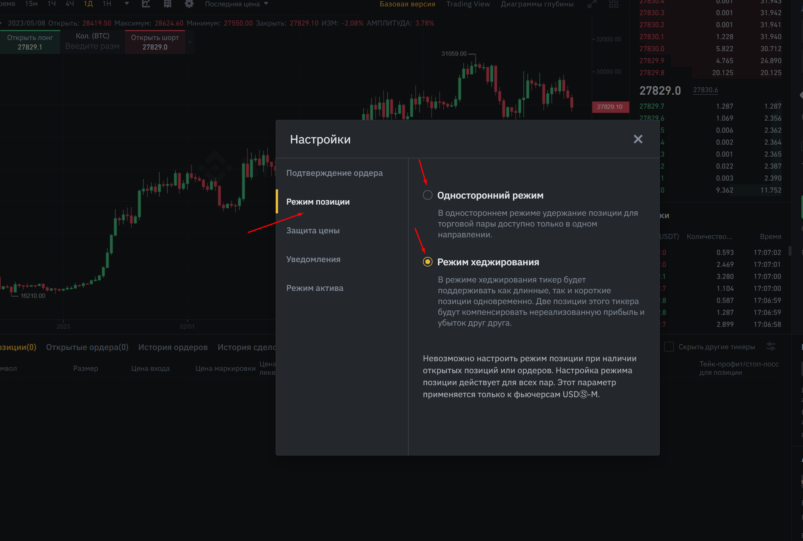
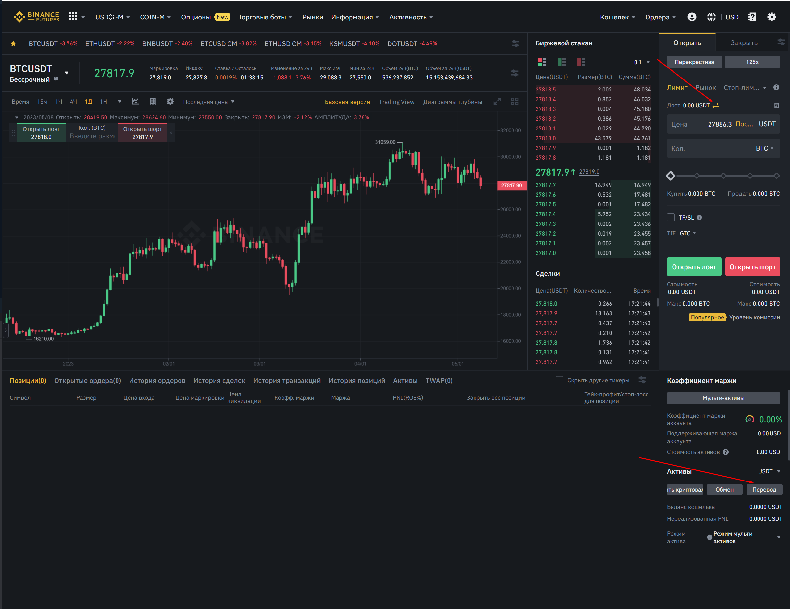
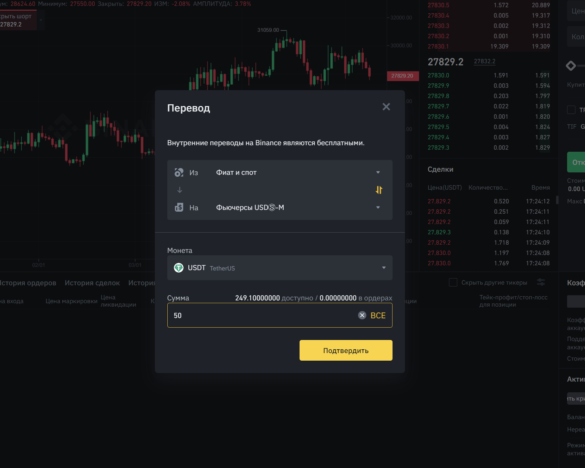
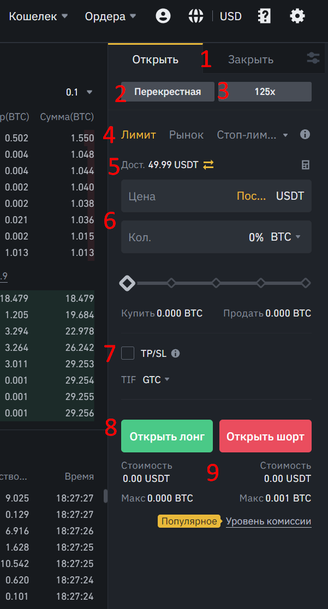
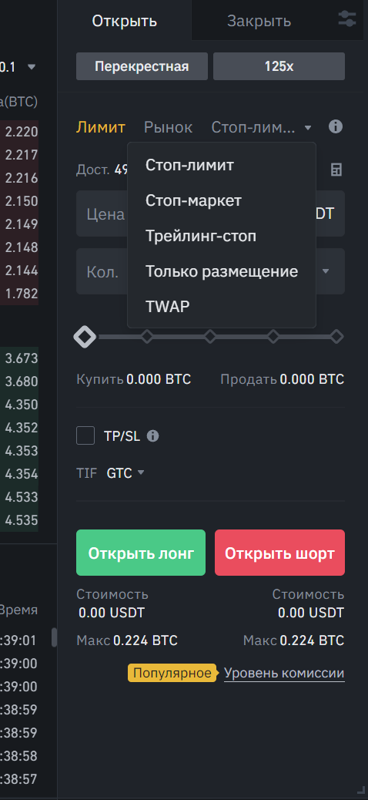

# Робота з Binance Futures | 1

**Binance Futures**
-------------------

З основним інтерфейсом **Binance** ви вже ознайомилися, тепер розгляньмо детальніше розділ **Binance Futures**, знайти його можна тут:

Нас цікавлять саме Ф'ючерси **USDT-M**, оскільки як забезпечення ми будемо використовувати саме **USDT**.

У випадку з Ф'ючерсами **COIN-M**, як забезпечення виступає обраний вами актив. Припустимо, під час торгівлі пари BTCUSD забезпеченням виступає BTC, у разі ETHUSD - забезпеченням виступає ефір (ETH) і так далі.

Слід розуміти, що ф'ючерсна торгівля - не є реальною торгівлею якогось активу. Тобто відкриваючи лонг (купівля) або шорт (продаж) - ви не взаємодієте з реальним активом. Саме тому при відкритті лонга за якимось активом - ви не можете його перевести на спотовий гаманець і там його продати.

По суті, ви укладаєте договір з біржею (ф'ючерс) на те, що ціна на якийсь актив зросте або впаде. Тому на ф'ючерсах ви торгуєте контрактами, а не самим активом. Завдяки такій реалізації - виходить можливість шортити.

**Шорт** \- відкриття позиції, метою якої є заробіток на падінні активу.

**Інтерфейс**
-------------

Тепер пробіжімось по інтерфейсу самих ф'ючерсів:

1 - Обраний актив. Також тут можна відкрити список і вибрати будь-який інший актив зі списку доступних.

2 - Інформація про обраний актив.

3 - Графік обраного активу. 

4 - "Біржовий стакан" - книга ордерів, де показується ордера на купівлю/продаж активу.

5 - "Угоди" - стрічка принтів виконаних заявок.

6 - Розділ управління позиціями і виставленими ордерами.

7 - Розділ виставлення ордерів.

8 - Розділ, де показується вся інформація про використовувану маржу і взаємодії з активами на ф'ючерсному гаманці.

Є два види відображення з розділом виставлення заявок, змінити це можна тут:

Я раджу використовувати режим хеджування, оскільки його інтерфейс набагато простіший і зрозуміліший за односторонній. Однак ви спробуйте обидва і виберіть більш зручний для вас.

Для того, щоб переказувати кошти на ф'ючерсний рахунок є дві кнопки:

Далі обираємо звідки ми будемо перекидати кошти на ф'ючерсний рахунок і яку кількість, після чого підтверджуємо:

Тепер кошти перебувають на ф'ючерсному рахунку і ми їх можемо використовувати як забезпечення для відкриття позицій.

**Маржа**
---------

**Маржа** \- кошти, які виступають як забезпечення і підтримання позиції.

На ф'ючерсах є два режими для забезпечення:

*   **Ізольована**. Вид забезпечення, де для кожної позиції трейдер обирає певну кількість забезпечення. Не взаємодіє з усіма коштами на ф'ючерсному рахунку.
*   **Перехресна (Крос)**. Вид маржі, де як забезпечення використовуються всі кошти, які знаходяться на ф'ючерсному рахунку.

Користуватися набагато зручніше саме крос-забезпеченням, тому що вам не треба проводити додаткові розрахунки для того, щоб вирахувати кількість потрібної маржі для підтримання позиції, щоб відкриту позицію не ліквідували раніше досягнення стоп-лосса. Багатьох лякає саме крос маржа через те, що вона використовує всі доступні кошти на рахунку і це асоціюється з втратою цих коштів. Однак це не так. За умови правильного ризик-менеджменту та використанням стоп-лосів - ліквідація неможлива.

**Плечі**
---------

**Плечі** \- інструмент, за допомогою якого можна торгувати на суму, що перевищує кошти трейдера. Грубо кажучи - це множник вашого депозиту. Однак неправильно вважати, що з його допомогою ви більше заробите або втратите, це не так. Прибуток і збиток залежить від обсягу вашої позиції, який своєю чергою залежить від точки входу і довжини вашого стопа. Тому якщо для дотримання ризику на угоду, припустимо, вам потрібно зайти в позицію, обсяг якої 1500 USDT, то під час використання плеча ви можете залучити не весь ваш депозит, а тільки його частину. Припустимо, під час використання плеча х10 - вам для входу в позицію достатньо мати на ф'ючерсному рахунку суму, що дорівнює 150 USDT, щоб відкрити позицію з потрібним для вас обсягом, під час використання плеча х50 - достатньо 30 USDT. Думаю логіку ви зрозуміли. Плечі - всього лише інструмент, який допомагає бути нашому депозиту більш ліквідним і використовувати менше маржі для забезпечення позиції, тим самим залишаючи більше вільних коштів у користуванні.

**Ордери**
----------

Давайте розберемо інтерфейс розділу з виставленням ордерів:

1 - вибір для ордерів, які використовуються для відкриття нової позиції або її закриття.

2 - вибір забезпечення.

3 - вибір плеча.

4 - ордери, за допомогою яких буде відкриватися/закриватися позиція.

5 - доступні кошти для забезпечення позиції.

6 - дані ордера, де вказується ціна та обсяг. Цей розділ залежатиме від обраного ордера.

7 - вибір ціни для стоп-лосу і тейк-профіту.

8 - вибір типу позиції: лонг або шорт.

9 - дані про відкриття позиції.

Тепер пробіжімось по типах ордерів:

**Лімітний ордер** - це ордер на продаж або купівлю активу за заданою ціною. Для купівлі слід вказувати ціну, нижчу за ринкову вартість активу, а для продажу - вищу за ринкову вартість активу. При досягненні зазначеної вами ціни викупите або продасте актив.

**Ринковий ордер** - ордер на продаж або купівлю активу за поточною ринковою ціною. Він гарантує, що угоду буде виконано негайно, але ціна може купівлі/продажу може бути трохи вищою/нижчою за ринкову. Це вже залежить від стакана й обсягу вашого ордера.

**Стоп-ліміт** - це ордер на купівлю або продаж активу, який автоматично стає лімітним у разі досягнення ціни обраної вами ціни.

**Стоп-маркет** - ордер на купівлю або продаж активу, який автоматично стає ринковим при досягненні заданої вами ціни.

Стоп-ліміт і стоп-маркет використовуються для виставлення стоп-лосса для позиції. Радимо використовувати стоп-маркет, оскільки за підвищеної волатильності цей ордер точно закриє вашу позицію, оскільки виконається він негайно за ринком. Це може спричинити трохи більші втрати, ніж ті, на які ви розраховували, однак гарантує закриття позиції. У випадку зі стоп-лімітом - за підвищеної волатильності є шанс, що ордер не здійсниться, бо не знайдеться для нього покупця/продавця за заданою вами ціною і потрібним для вас обсягом, що може спричинити ще більші втрати або зовсім ліквідацію. Тому для стоп-лосса використовуємо стоп-маркет.

Трейлінг-стоп, тільки розміщення і TWAP ордера ми використовувати не будемо, але якщо вам цікаво, то докладніше про ці типи ордерів ви можете дізнатися на **Binance**.

**До зустрічі в наступному уроці!**