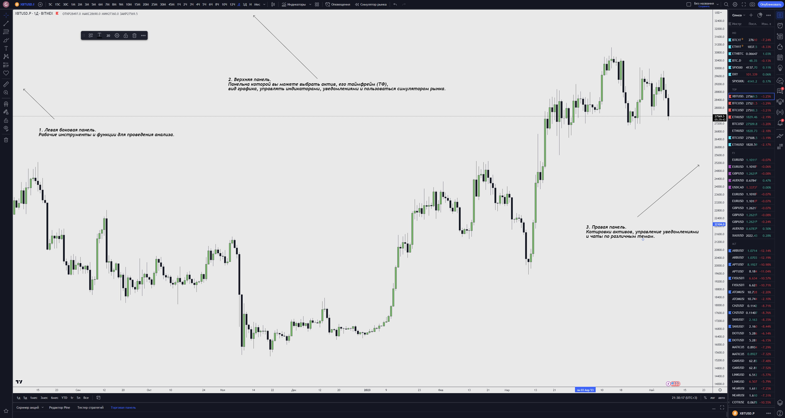
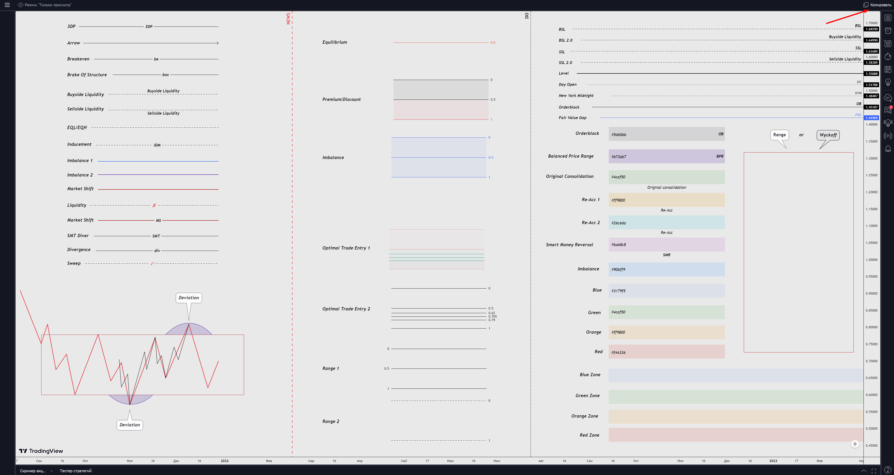
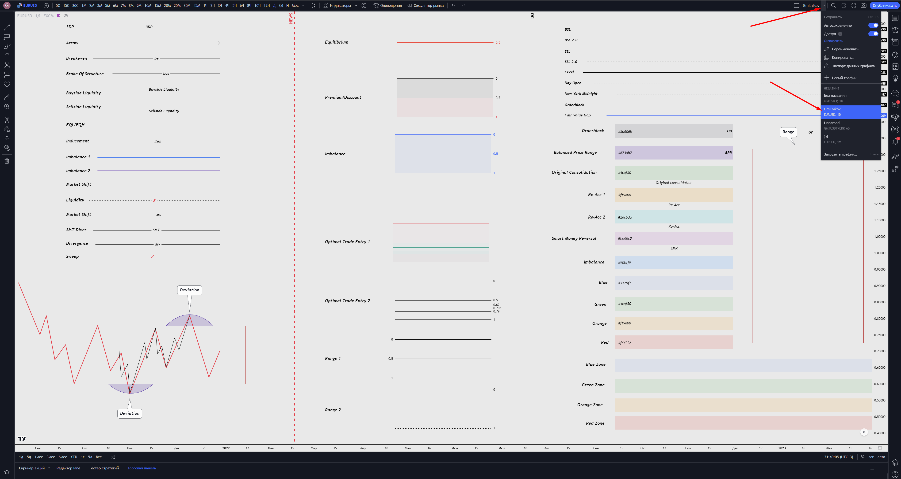
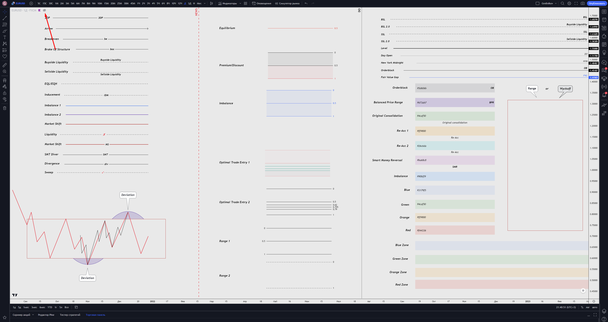
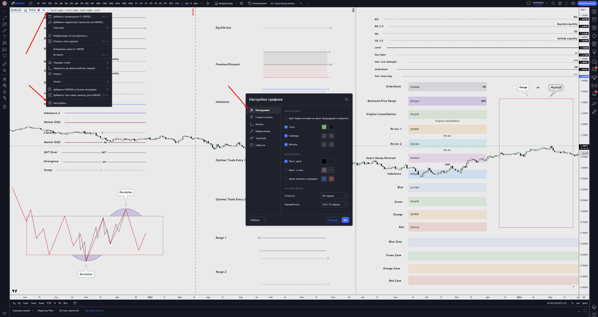

# Робота з TradingView | 1

[TradingView](https://ru.tradingview.com/gopro/?share_your_love=gm1336) **(далі ТВ)** - сервіс, за допомогою якого ми проводимо аналіз торгових інструментів. Саме його ми будемо використовувати для подальшого аналізу. Чому не графіки бірж? Відповідь досить очевидна. Річ у тім, що графіки бірж мають урізаний функціонал, та й проводити аналіз на самій біржі справа невдячна і незручна, можете самі в цьому переконатися. Графіки на біржах мають дуже урізаний функціонал і сильно поступаються в зручності TradingView.

Для новачків - буде цілком достатньо безоплатної версії, особливо якщо ви заходитимете на цю платформу тільки, щоб дізнатися ціну активу. У разі якщо вам цього недостатньо, то я радив би щонайменше взяти пробну версію після навчання, щоб дізнатися про всі її переваги та вирішити для себе, чи є сенс оплачувати хоча б найбазовішу версію (Спойлер: так, є).

**ТВ** надає 3 варіанти підписки: **Pro, Pro+ і Premium**. Усі їхні відмінності ви зможете дізнатися на їхньому сайті, але забігаючи наперед скажу, що підписки "**Pro**" для новачків буде більш ніж достатньо.

Тепер розгляньмо сам інтерфейс. ТВ має великий набір інструментів і налаштувань, ми будемо користуватися звичайно не всіма, але більшістю.

Детальніше про ці панелі ви зможете дізнатися у відео, яке йде до цього уроку.

Думаю, на фото вище одразу видно, де розташований графік, і саме аналіз графіка становитиме більшу частину часу, тому переходимо до нього.

Графік буває різний: лінійний, японські свічки тощо. Ми будемо використовувати графік, який представлений у вигляді японських свічок. Для того, щоб його зрозуміти - нам слід розібратися в японських свічках:

**Буває всього кілька видів японських свічок:**

*   **Бичача свічка** - свічка, яка закрилася вище за ціну свого відкриття.
*   **Ведмежа свічка** - свічка, яка закрилася нижче ціни свого відкриття.
*   **Доджі** \- свічка, яка закрилася за ціною свого відкриття.

Наступне, що нам потрібно для правильного розуміння свічок - **таймфрейм**.

**Таймфрейм (далі ТФ)** - це значення часу, за який формується свічка. Тобто якщо ви вибираєте годинний ТФ (1h), то це означає, що кожна свічка на графіку буде нести в собі інформацію про рух ціни за одну годину. Позначення таймфреймів, з якими Ви можете зіткнутися:

*    **1М** \- місячний ТФ.
*   **1W** \- тижневий ТФ.
*   **3D/1D** - 3-х денний / денний ТФ.
*    **4h** \- 4-х годинний ТФ.
*   **1h** \- годинний ТФ.
*   **m15** \- 15-ти хвилинний ТФ.
*    **m5/m1** - п'яти/хвилинний ТФ.
*   **30s** \- 30-ти секундний ТФ.

Про всі основні функції ми докладніше розповіли Вам у відео.

Шаблон налаштування моїх інструментів і графіка - [https://ru.tradingview.com/chart/8MIOi7cM](https://ru.tradingview.com/chart/8MIOi7cM)

Тут Ви можете скопіювати налаштування всіх моїх інструментів, які я використовую і зберегти їх собі як шаблон, попередньо налаштувавши їх під себе. Щоб це зробити Вам потрібно його скопіювати:

Після чого він почне відображатися у вас ось тут:

На жаль, ця функція доступна тільки для платної версії ТВ. Ви можете взяти пробний період, щоб зберегти собі всі налаштування інструментів і вже після цього її скасувати.

І вже після того, як Ви його скопіювали - зможете повністю змінювати та зберігати інструменти за Вашим бажанням.

Також тут Ви зможете знайти мої налаштування графіка. Щоб їх побачити - увімкніть відображення графіка і натисніть на нього два рази та перед Вами відкриються мої налаштування, які Ви можете видозмінити:

У цьому уроці Ви дізналися про один з важливих сервісів для проведення аналізу Ваших торгових активів.

**До зустрічі в наступному уроці!**