# Ліквідність | 2

Ліквідністю для розумного капіталу/маркетмейкера виступають ордери інших учасників ринку. Саме завдяки їм він може купити або продати актив без істотного впливу на ціну. Для відкриття позиції йому потрібні зворотні заявки: для купівлі йому потрібні ордери на продаж, а для продажу йому потрібні ордери на купівлю. І цими зворотними заявками найчастіше виступають стоп-накази інших учасників ринку.

Схематично це має такий вигляд:

*   **набір довгої (лонгової) позиції:**  
    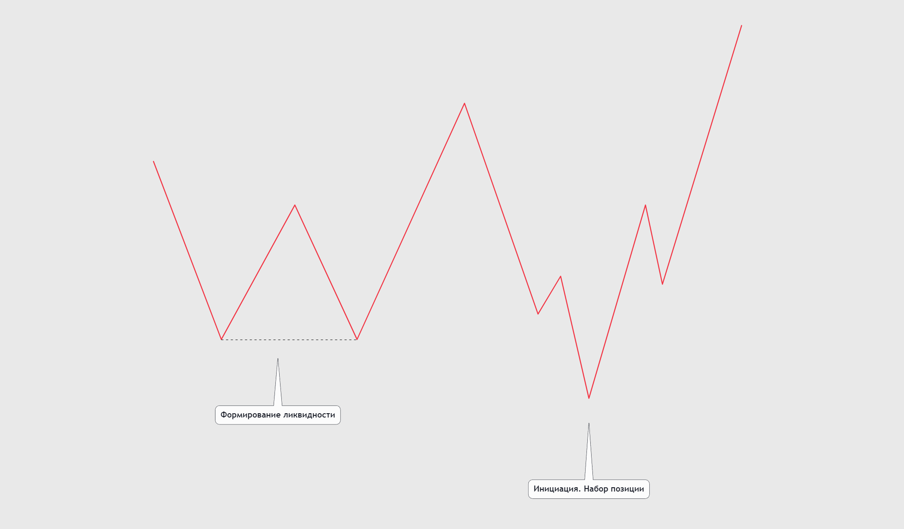
*   **набір короткої (шортової) позиції:  
    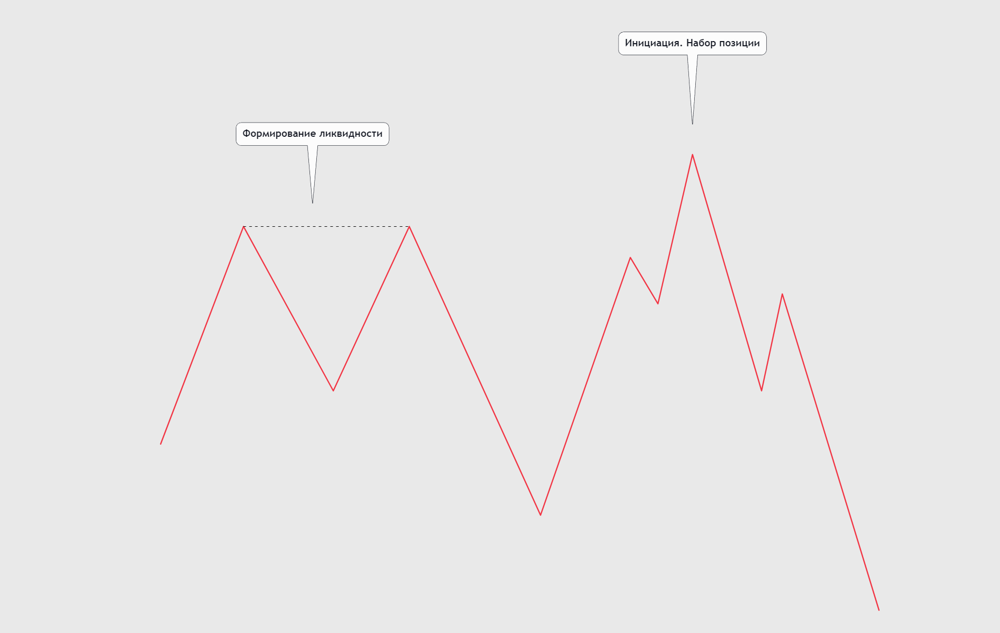**

Логіка набору позиції в обох прикладах однакова, відрізняється тільки тим, у який бік маркетмейкер збирається доставляти ціну.

Спочатку він формує пул ліквідності (місце скупчення ордерів інших учасників ринку), де надалі активуються ордери інших трейдерів. Відбувається це за різними факторами, хтось бачить тут рівень підтримки й виставляє свій стоп-наказ за цей пул ліквідності, скальпери починають торгувати його на відбій/пробій тощо.

Чому ж це відбувається саме таким чином? Володіючи практично необмеженим капіталом - маркетмейкер не може відкрити позицію ринковим ордером, оскільки це матиме прямий вплив на ціну у зв'язку з великим об'ємом, а ціна входу в позицію може виявитися невигідною, також подальшому доставленню ціни заважатимуть інші учасники ринку, тим самим зупиняючи ціну фіксацією своїх позицій. Ініціюючи маніпуляцію - маркетмейкер не тільки може набрати позицію з потрібним для нього об'ємом, так він ще й позбувається трейдерів, які можуть заважати йому фіксуватися, а потім частина з цих трейдерів відкриватимуть нові позиції за менш вигідними для них цінами, стимулюючи ціну йти в потрібному напрямку для маркетмейкера, але також ліквідність може виступати для подальшого доставлення ціни або зовсім для фіксації позиції розумним капіталом. Саме тому ціна рухатиметься від однієї ліквідності до іншої.

**Я поділяю ліквідність на три види:**

1.  **Окремий свінг.** Найочевидніша ліквідність, яка перебуває за кожним свінг-лоєм або свінг-хаєм.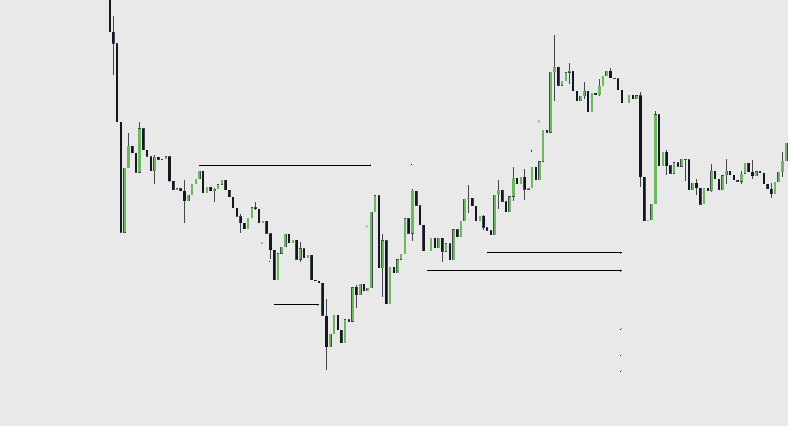
2.  **Рівні лої/хаї (EQL/EQH).** Сильний пул ліквідності, служить сильним магнітом для ціни.  
    Правильний приклад **EQH/EQL**: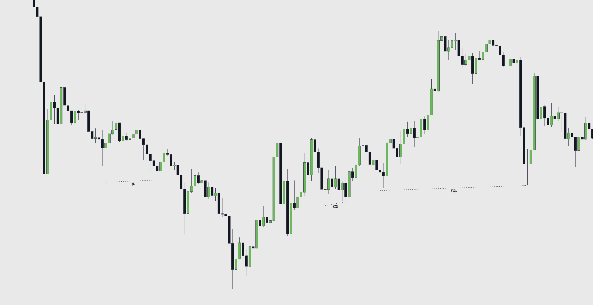  
    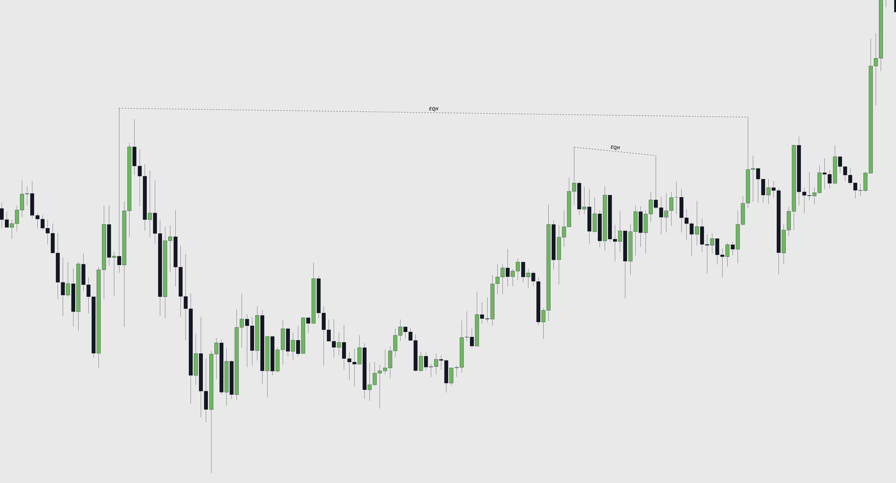  
    Неправильний приклад **EQH/EQL**:  
    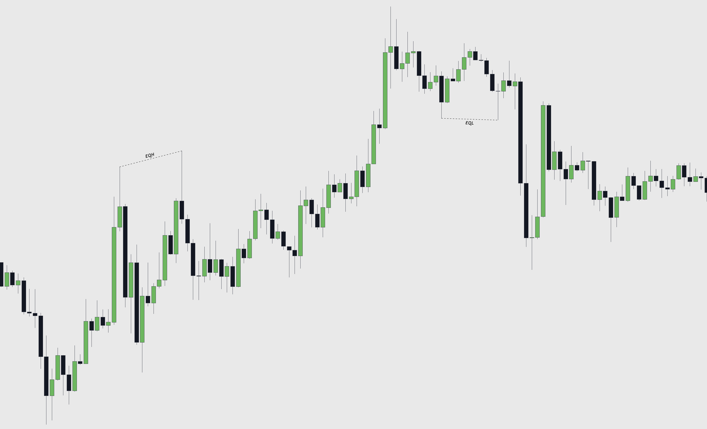У цьому прикладі це не вважається пулом ліквідності, оскільки наступний екстремум знімав ліквідність із попереднього: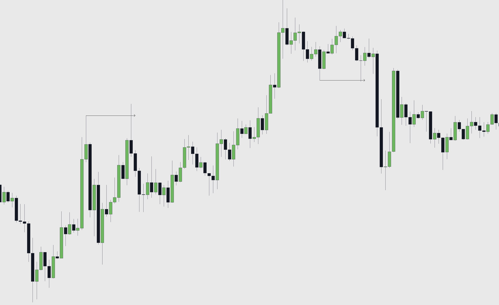
3.  **Компресія/трендова.** Слугує сильним магнітом для ціни, оскільки за кожним зі свінгів розташована велика кількість ліквідності.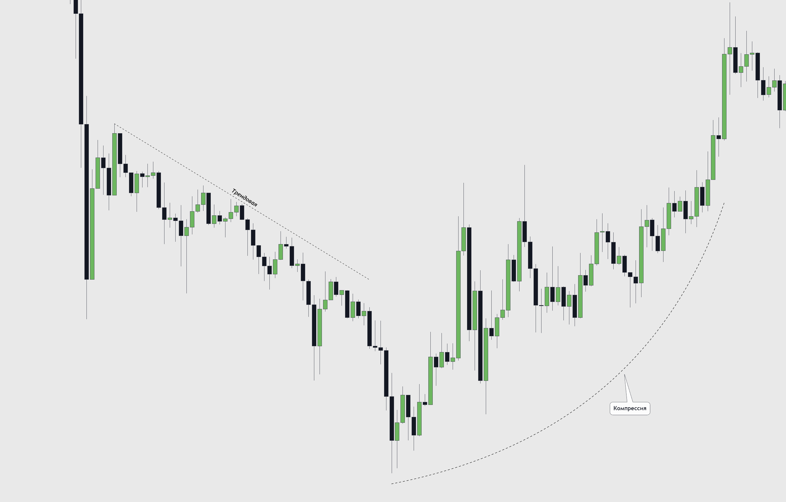

У більшості випадків ціна знімає цю ліквідність одним агресивним рухом.

Будь-яка ліквідність для нас виступатиме як потенційне місце для фіксації наших позицій.

Всю ліквідність можна розділити на два типи:

*   **BSL (Buy Side Liquidity)** - ліквідність на стороні покупця, виступає метою для покупців.
*   **SSL (Sell Side Liquidity)** - ліквідність на стороні продавця, виступає метою для продавців.

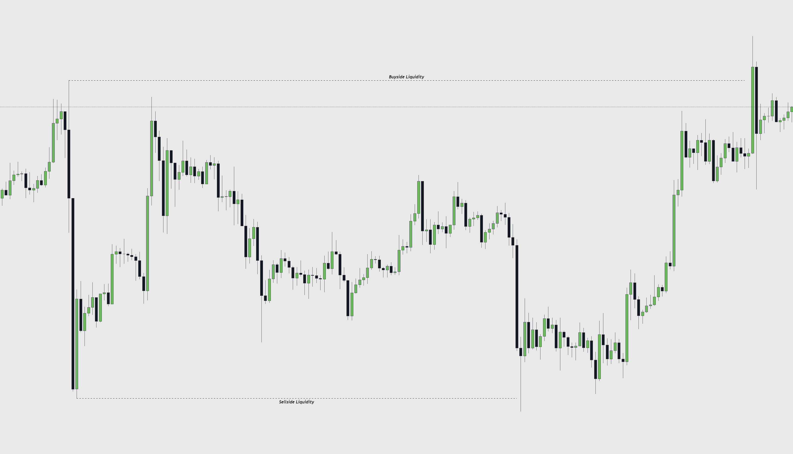

Також ця ліквідність буває як **внутрішньою**, так і **зовнішньою**, а саме **internal** і **external**.

Приклад, коли ціна перебуває в боковику:

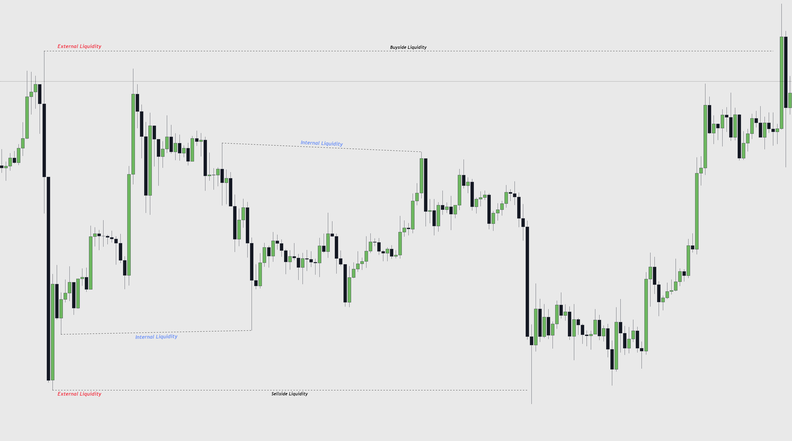

Приклад при структурному русі ціни:

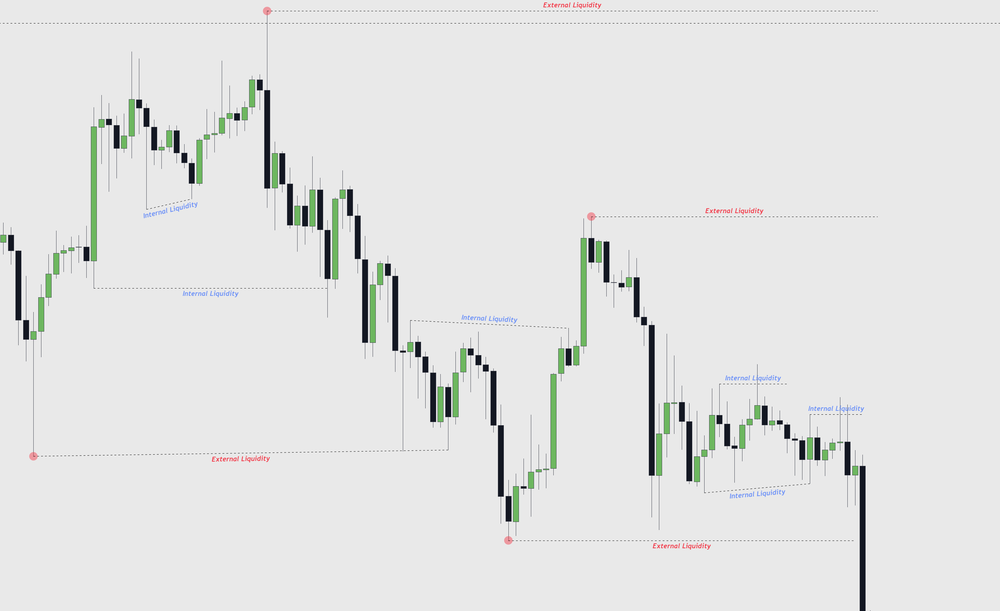

Зовнішня ліквідність перебуває на свінг-лоях/хаях, які формують структуру і межі торгового діапазону.

Внутрішня ліквідність знаходиться між свінгами, що формують структуру і всередині торгового діапазону.

Під час спостереження за ліквідністю варто слідувати правилу **"From Internal to External"**, що дослівно говорить нам про те, що ціна ходитиме від внутрішньої ліквідності до зовнішньої в більшості випадків.

Розуміння того, як розумний капітал працює з ліквідністю і використовує її для набору своїх позицій, надає вам перевагу порівняно з іншими трейдерами. Також ліквідність надає рівень для можливої фіксації вашої позиції.

**До зустрічі в наступному уроці!**