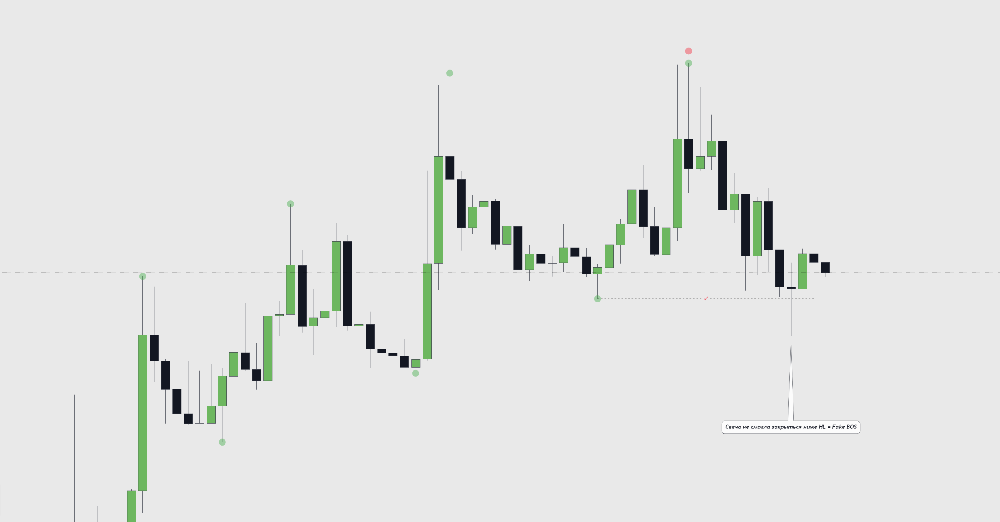
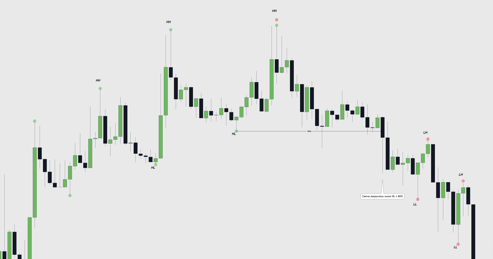

# Структура. Структурні свінги | 2

**Структурні свінги**
---------------------

Перш ніж визначити структуру, нам важливо правильно визначити структурні свінги - **Swing High and Swing Low**.

**Свінг (Swing)** \- структурна точка, яка складається з 3-х свічок.

**Swing High** \- це свічкова формація, що складається з 3-х свічок, де максимуми сусідніх свічок нижчі за центральну.

**Swing Low** \- це свічкова формація, що складається з 3-х свічок, де мінімуми сусідніх свічок вищі за центральну.

Схематичний приклад:

Приклад на графіку:

Також для більш точного визначення свінгів можете скористатися індикатором: **"Wick.ED Fractals"**, однак врахуйте, що цей індикатор просто показує абсолютно всі свінги, які формуються на графіку, і за ним не варто визначати подальшу структуру, що формується на графіку. Цей індикатор найкраще використовувати для повторної перевірки себе, чи правильно ви визначили свінг і не більше.

**Кожен свінг має своє визначення:**

**HH - higher high** (більш вищий максимум).

**HL - higher low** (більш вищий мінімум).

**LH - lower high** (більш нижчий максимум).

**LL - lower low** (більш нижчий мінімум).

Кожен мінімум або максимум визначається вищим або нижчим порівняно з попереднім мінімумом або максимумом.

Свінги формують структуру, яка ділиться на два типи: бичачу структуру і ведмежу.

**Бичача структура** - висхідний рух, за якого ціна формує вищі максимуми **(HH)** і мінімуми **(HL)**.

**Ведмежа структура** - спадний рух, за якого ціна формує нижчі максимуми **(LH)** і мінімуми **(LL)**.

Схематичний приклад:

Графічний приклад:

На різних таймфреймах структура відрізнятиметься, і важливо визначати структуру того таймфрейму, який ви аналізуєте.

Злам ринкової структури
-----------------------

**BOS/BMS/MSB/ChoCh (Break Of Structure/Break Market Structure/Market Structure Break/Change of Character)** - різні визначення зламу ринкової структури, сенс у них однаковий.

Для низхідного руху зламом буде закриття вище попереднього **LH**. Або ж можна запам'ятати як закріплення вище хая, який дав нам новий нижчий лой **(LL)**.

Для висхідного руху зламом буде закриття нижче попереднього **HL**. Або ж можна запам'ятати як закріплення нижче лоя, який дав нам новий вищий хай **(HH)**.

Схематичний приклад:

Графічний приклад зламу низхідної структури на висхідну:

Графічний приклад зламу висхідної структури на спадну:

Fake Bos
--------

Дуже важливо розуміти, коли стався справжній злам структури, а коли ціна просто зняла ліквідність.

Попри те, що ціна сформувала **НН** \- це не вважається зламом структури, оскільки ціна не закріпилася тілом вище за лінію зламу структури, тобто вище за попередній хай **"LH"**, а просто зняла ліквідність, яка перебуває за свінгом.

Для висхідної структури утворення **"LL"** буде зламом структури тільки тоді, коли ціна закріпиться тілом нижче **"HL"**:

Тобто в цьому випадку ціна не зробила злам структури, а просто зібрала ліквідність і продовжила рухатися структурою.

Визначення структури є одним з найважливіших інструментів під час аналізу графіка і є фундаментом для концепції **Smart Money**. З її допомогою ми можемо визначити подальший напрямок ціни й не торгувати проти тренду, оскільки **"Trend is your friend"**.

**До зустрічі в наступному уроці!**